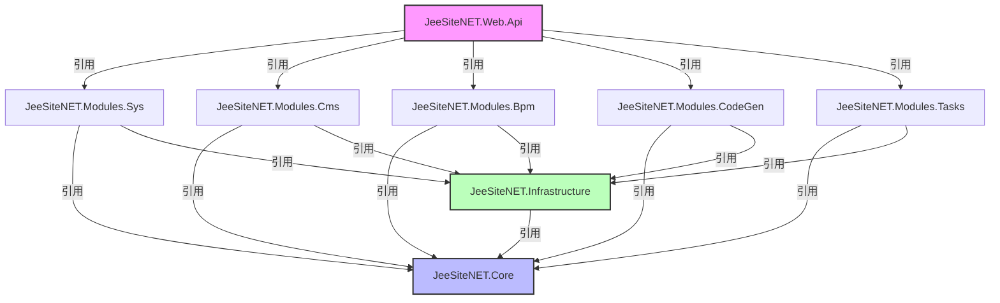
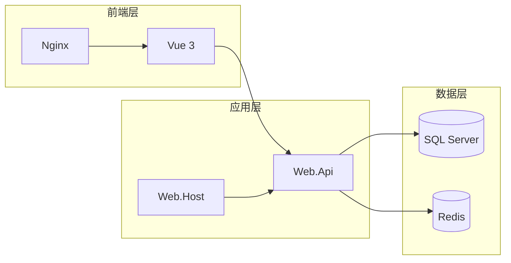
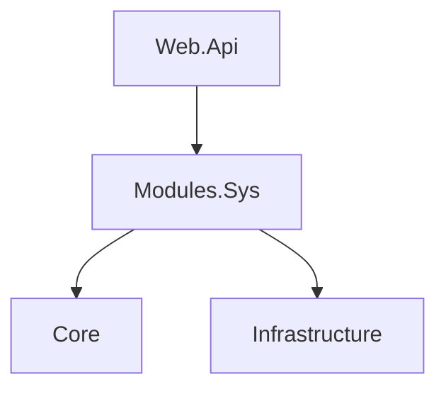

# JeeSite.NET 项目结构与依赖关系分析

## 一、项目整体架构

### 解决方案结构

```
JeeSiteNET.sln
├── src/                          # 核心层
│   ├── JeeSiteNET.Core           # 基础核心类库
│   ├── JeeSiteNET.Infrastructure # 基础设施层
│   ├── JeeSiteNET.Web.Api        # REST API 应用
│   └── JeeSiteNET.Web.Host       # Blazor 主机应用
├── modules/                      # 功能模块
│   ├── JeeSiteNET.Modules.Sys    # 系统管理
│   ├── JeeSiteNET.Modules.Cms    # 内容管理
│   ├── JeeSiteNET.Modules.Bpm    # 流程引擎
│   ├── JeeSiteNET.Modules.CodeGen# 代码生成
│   ├── JeeSiteNET.Modules.Tasks  # 任务调度
│   ├── JeeSiteNET.Modules.App    # 应用模块
│   └── JeeSiteNET.Modules.Test   # 测试模块
├── tests/                        # 测试项目
│   └── JeeSiteNET.Core.Tests
└── frontend/                     # 前端项目
    └── Vue 3 + Ant Design Vue
```

---

## 二、项目依赖关系图

### 2.1 依赖层级关系（Mermaid格式）



### 2.2 依赖矩阵表

| 项目 | JeeSiteNET.Core | JeeSiteNET.Infrastructure | Modules.Sys | Modules.Cms | Modules.Bpm | Modules.CodeGen | Modules.Tasks | Web.Api |
|------|-----------------|----------------------------|-------------|-------------|-------------|-----------------|---------------|---------|
| JeeSiteNET.Core | - | - | - | - | - | - | - | - |
| JeeSiteNET.Infrastructure | **✓** | - | - | - | - | - | - | - |
| Modules.Sys | **✓** | **✓** | - | - | - | - | - | - |
| Modules.Cms | **✓** | **✓** | - | - | - | - | - | - |
| Modules.Bpm | **✓** | **✓** | - | - | - | - | - | - |
| Modules.CodeGen | **✓** | **✓** | - | - | - | - | - | - |
| Modules.Tasks | **✓** | **✓** | - | - | - | - | - | - |
| Web.Api | - | - | **✓** | **✓** | **✓** | **✓** | **✓** | - |

---

## 三、各项目详细依赖

### 3.1 核心层

**JeeSiteNET.Core**：
```json
{
  "dependencies": {
    "SkiaSharp": "3.116.1",
    "ZiggyCreatures.FusionCache": "2.6.0"
  }
}
```

**JeeSiteNET.Infrastructure**：
```json
{
  "projectReferences": ["JeeSiteNET.Core"],
  "dependencies": {
    "Microsoft.EntityFrameworkCore": "9.0.0",
    "Microsoft.EntityFrameworkCore.SqlServer": "9.0.0"
  }
}
```

### 3.2 API 层

**JeeSiteNET.Web.Api**：
| 依赖项 | 版本 | 用途 |
|--------|------|------|
| Microsoft.AspNetCore.Authentication.JwtBearer | 10.0.7 | JWT认证 |
| Swashbuckle.AspNetCore | 7.0.0 | API文档 |
| ZiggyCreatures.FusionCache | 2.6.0 | 多级缓存 |
| Microsoft.Extensions.Caching.StackExchangeRedis | 10.0.8 | Redis缓存 |
| Elsa | 3.6.0 | 工作流引擎 |
| Snappier | 1.3.1 | 数据压缩 |

### 3.3 功能模块

| 模块 | 外部NuGet依赖 |
|------|--------------|
| **Modules.Sys** | System.IdentityModel.Tokens.Jwt 8.19.1 |
| **Modules.Bpm** | Elsa 3.6.0, Snappier 1.3.1 |
| **Modules.CodeGen** | Scriban 7.2.3, Microsoft.Data.SqlClient 6.0.2 |
| **Modules.Tasks** | Quartz 3.14.0, Quartz.Extensions.DependencyInjection, Quartz.Extensions.Hosting |

### 3.4 前端依赖

**frontend/package.json**：
```json
{
  "dependencies": {
    "vue": "^3.5.13",
    "vue-router": "^4.5.0",
    "pinia": "^3.0.0",
    "ant-design-vue": "^4.2.0",
    "@ant-design/icons-vue": "^7.0.0",
    "axios": "^1.7.0",
    "dayjs": "^1.11.0"
  },
  "devDependencies": {
    "@vitejs/plugin-vue": "^5.2.0",
    "typescript": "~5.7.0",
    "vite": "^6.3.0",
    "vue-tsc": "^2.2.0",
    "less": "^4.2.0"
  }
}
```

---

## 四、模块划分与职责

| 模块 | 核心实体 | 核心服务 |
|------|----------|----------|
| **Sys** | User, Role, Menu, Dict, Log, Config | AuthService, RoleService, MenuService, LogService |
| **Cms** | Article, Category, Comment, Guestbook, Site | ArticleService, CategoryService, CmsService |
| **Bpm** | ApprovalRecord, WorkflowForm | BpmService |
| **CodeGen** | GenTable, GenTableColumn | CodeGenService, GenTableService |
| **Tasks** | TasksJob | TasksService |
| **App** | AppComment, AppUpgrade | AppService |

---

## 五、关键技术栈

### 后端技术栈
| 分类 | 技术 | 版本 |
|------|------|------|
| 框架 | ASP.NET Core | 10.0 |
| ORM | Entity Framework Core | 9.0 |
| 缓存 | FusionCache | 2.6.0 |
| 工作流 | Elsa Workflows | 3.6.0 |
| 定时任务 | Quartz.NET | 3.14.0 |
| 认证 | JWT Bearer | 10.0.7 |

### 前端技术栈
| 分类 | 技术 | 版本 |
|------|------|------|
| 框架 | Vue | 3.5.13 |
| 状态管理 | Pinia | 3.0.0 |
| 路由 | Vue Router | 4.5.0 |
| UI组件 | Ant Design Vue | 4.2.0 |
| 构建工具 | Vite | 6.3.0 |

---

## 六、部署架构



---

## 七、Vibe Coding 工具兼容性说明

### 7.1 Mermaid 图表支持

本文档中的依赖关系图使用 **Mermaid 语法**编写，Vibe Coding 工具可以识别并渲染：



### 7.2 支持的图表类型

| 图表类型 | 语法 | 示例 |
|----------|------|------|
| 流程图 | `flowchart` / `graph` | 依赖关系图 |
| 序列图 | `sequenceDiagram` | API调用流程 |
| 类图 | `classDiagram` | 实体关系 |
| 状态图 | `stateDiagram` | 业务状态流转 |
| 饼图 | `pie` | 模块占比 |

### 7.3 依赖矩阵兼容性

表格格式的依赖矩阵也可以被 Vibe Coding 工具解析，但建议配合以下标记增强可识别性：

```
<!-- vibe-dependency-matrix -->
| 项目 | Core | Infrastructure | Sys | Cms |
|------|------|----------------|-----|-----|
```

### 7.4 JSON 格式支持

文档中的 JSON 代码块可以被 Vibe Coding 工具直接解析为结构化数据：

```json
{
  "project": "JeeSiteNET.Core",
  "dependencies": ["SkiaSharp", "FusionCache"]
}
```

### 7.5 最佳实践建议

1. **使用标准 Mermaid 语法**：确保图表能被正确渲染
2. **添加标识注释**：在关键图表前添加 `<!-- vibe-xxx -->` 注释
3. **保持代码块格式**：使用 ```json、```mermaid 等标记
4. **使用相对路径**：引用其他文档时使用相对路径

---

## 附录：依赖关系JSON（供工具解析）

```json
{
  "solution": "JeeSiteNET.sln",
  "targetFramework": "net10.0",
  "projects": [
    {
      "name": "JeeSiteNET.Core",
      "path": "src/JeeSiteNET.Core",
      "type": "classLibrary",
      "nugetDependencies": ["SkiaSharp", "ZiggyCreatures.FusionCache"]
    },
    {
      "name": "JeeSiteNET.Infrastructure",
      "path": "src/JeeSiteNET.Infrastructure",
      "type": "classLibrary",
      "projectReferences": ["JeeSiteNET.Core"],
      "nugetDependencies": ["Microsoft.EntityFrameworkCore", "Microsoft.EntityFrameworkCore.SqlServer"]
    },
    {
      "name": "JeeSiteNET.Web.Api",
      "path": "src/JeeSiteNET.Web.Api",
      "type": "webApi",
      "projectReferences": ["JeeSiteNET.Modules.Sys", "JeeSiteNET.Modules.Cms", "JeeSiteNET.Modules.Bpm", "JeeSiteNET.Modules.CodeGen", "JeeSiteNET.Modules.Tasks"],
      "nugetDependencies": ["Microsoft.AspNetCore.Authentication.JwtBearer", "Swashbuckle.AspNetCore", "ZiggyCreatures.FusionCache", "Elsa", "Snappier"]
    }
  ],
  "modules": [
    {"name": "Sys", "description": "系统管理"},
    {"name": "Cms", "description": "内容管理"},
    {"name": "Bpm", "description": "流程引擎"},
    {"name": "CodeGen", "description": "代码生成"},
    {"name": "Tasks", "description": "任务调度"},
    {"name": "App", "description": "应用模块"},
    {"name": "Test", "description": "测试模块"}
  ]
}
```

---

**文档版本**: v1.0  
**生成日期**: 2026-06-07  
**适用工具**: Vibe Coding, Mermaid 兼容编辑器
