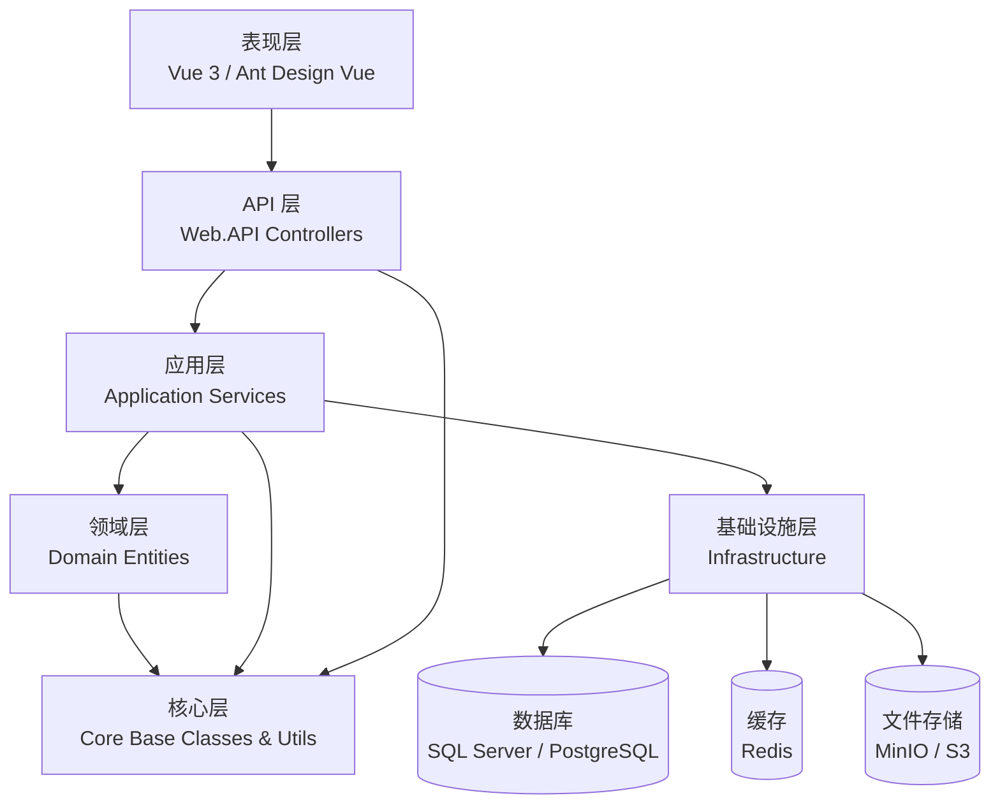
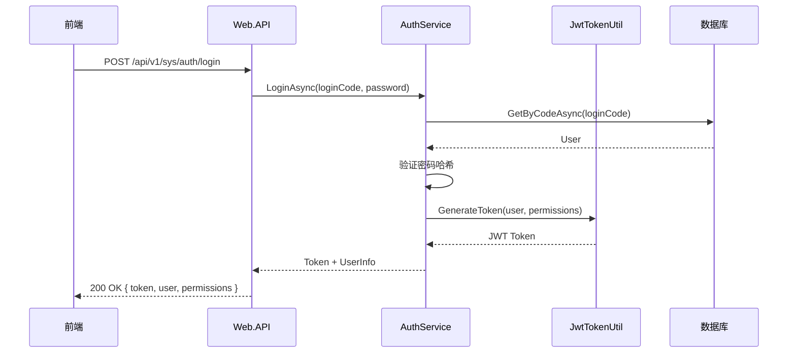

<div align="right">
  <a href="../wiki/Home.md">← 返回 Wiki 首页</a>
</div>

---

# Wiki 文档修改完善方案

> 基于对现有 33 份 wiki 文档（2026-06-13 版本）的抽样分析，提出系统性改进建议。
>
> **文档目的**：统一文档风格、完善内容深度、增强可读性、保障与代码一致性
> **适用角色**：文档维护者、核心贡献者
> **预计工作量**：约 2-3 天（分批实施）
>
> 最后更新: 2026-06-13

---

## 🔍 现状分析

### 1.1 已完成的工作

| 项目 | 状态 | 说明 |
|------|------|------|
| 基础结构 | ✅ 已完成 | 首页、侧边栏、页脚完整 |
| 文档分类 | ✅ 已完成 | 5 大分类（模块手册/工具类/安全认证/高级特性/开发运维） |
| 命名规范 | ✅ 已完成 | `NN-主题.md` 两位数字编号 |
| 基础内容 | ✅ 已完成 | 各模块和工具类文档已存在正文 |
| 导航元素 | ⚠️ 部分完成 | 顶部返回首页、页脚统一，但文档内部跳转不完善 |

### 1.2 主要问题（按优先级排序）

| 优先级 | 问题类别 | 具体描述 | 影响文档数 |
|--------|---------|---------|-----------|
| **P0** | **标题编号不一致** | 部分文档标题带编号（如 `# 01. 快速入门`），部分不带（如 `# Sys系统管理`），导致侧边栏排序和跳转不稳定 | ~15 份 |
| **P0** | **文件名 vs 文档标题不匹配** | 文件名 `02-系统架构概览.md` 但首页链接为 `[系统架构](02-系统架构)`，导致用户体验不一致 | ~20 份 |
| **P1** | **缺少"快速参考"章节** | 工具类和 API 文档应在末尾提供一张"5 行速查表"（核心方法 + 参数 + 示例），方便开发人员快速查找 | ~25 份 |
| **P1** | **缺少代码示例** | 文档大量描述功能点，但可直接复制运行的 C#/TypeScript 代码示例不足 | ~20 份 |
| **P1** | **缺少配置清单表** | 涉及配置的文档（JWT/Redis/数据库/Elasticsearch 等）未提供完整配置键清单表 | ~10 份 |
| **P2** | **缺少架构/Mermaid 图示** | 架构文档、数据流文档、权限体系文档缺少可视化图示 | ~8 份 |
| **P2** | **文档编号不连续** | 01-02 是入门/架构，03-08 是模块手册，中间没有预留空间。实际命名使用了"模块"后缀但没有统一 | 全局 |
| **P2** | **相关文档交叉引用不足** | 每份文档的"相关文档"部分只列出了 1-2 份，缺少完整的上下游文档跳转 | ~30 份 |
| **P2** | **缺少版本兼容性说明** | 未说明每个功能在哪个 .NET 版本/数据库版本上可用 | 全局 |
| **P3** | **调试与故障排查不足** | 每份文档应包含"常见问题"或"故障排查"章节，目前仅 01-快速入门 有此章节 | ~28 份 |
| **P3** | **缺少 API 与代码的一致性校验** | 没有文档说明 API 文档如何与实际代码保持同步（如 controller 新增 endpoint 后如何更新 wiki） | 全局 |
| **P3** | **文档版本标记** | 缺少"新增于 v1.2"或"已废弃"的标记机制 | 全局 |

---

## 🎯 改进目标

| 目标 | 具体内容 |
|------|---------|
| **G1: 标题与命名统一** | 所有文档使用一致的标题格式（`# NN 文档标题`，不使用点号分隔） |
| **G2: 每份文档的标准 6 段式结构** | 标题块 → 描述块 → 目录 → 正文 → 快速参考 → 相关文档 |
| **G3: 增加 50+ 可运行代码示例** | 在工具类和模块文档中添加可直接复制运行的 C# 代码片段 |
| **G4: 增加 15+ 配置清单表** | 涉及 appsettings.json / 数据库配置的文档，提供完整键清单 |
| **G5: 增加 Mermaid 架构图** | 在关键文档中加入架构/数据流/权限体系图 |
| **G6: 增强 FAQ 和故障排查** | 每份文档末尾添加 3-5 个常见问题和排查思路 |
| **G7: 文档维护机制** | 建立 wiki 更新流程、版本标记、代码一致性校验 |

---

## 📋 详细改进计划

### 🔴 P0: 标题与命名统一（最高优先级）

**问题**: 文档标题格式不一致，存在以下变体：
- `# 01. 快速入门`（有点号，文件名无点号 → 01-快速入门.md）
- `# 02. 系统架构概览`（点号 + 概览后缀）
- `# Sys系统管理`（无编号，依赖文件系统排序）

**统一方案**: 所有文档统一使用以下标题格式：

```markdown
# NN 文档标题
```

其中：
- `NN` 为两位数字（与文件名一致）
- 不使用点号（`.`）或其他分隔符
- 标题与文件名一致（便于 GitHub Wiki 的锚点自动生成）

**需修改的文档清单**:

| # | 文件名 | 原标题 | 修改后标题 |
|---|--------|--------|-----------|
| 1 | `01-快速入门.md` | `# 01. 快速入门` | `# 01 快速入门` |
| 2 | `02-系统架构概览.md` | `# 02. 系统架构概览` | `# 02 系统架构概览` |
| 3-33 | 其他 31 份文档 | 各自不同格式 | 统一为 `# NN 文档标题` |

**同步修改 Home.md 的链接文本**:
- 确保 Home.md 中链接显示文本与目标文档标题一致
- 例如：`[02 系统架构概览](02-系统架构概览)` 需指向正确文件

**额外要求**:
- 所有中文符号统一改为英文符号（例如使用 `:` 而非 `：` 除非在表格文本中）
- 标题中避免使用 emoji，保持专业简洁
- 确保 GitHub Wiki 侧边栏显示为统一的 `NN 标题` 格式

---

### 🟠 P1: 文档内容深度增强（高优先级）

#### 1.1 每份文档添加"快速参考"章节

**位置**: 正文最后一节之后，FAQ 之前

**标准结构**:

```markdown
## 💡 快速参考

### 核心类与接口

| 类型 | 名称 | 命名空间 | 说明 |
|------|------|---------|------|
| Entity | `User` | `JeeSiteNET.Modules.Sys.Domain.Entities` | 用户实体 |
| Service | `UserService` | `JeeSiteNET.Modules.Sys.Application.Services` | 用户业务逻辑 |
| Controller | `UserController` | `JeeSiteNET.Modules.Sys.Controllers` | 用户 API |
| Repository | `IUserRepository` | `JeeSiteNET.Modules.Sys.Domain.Interfaces` | 用户仓储接口 |

### 常用 API 速查

| API | 方法 | 说明 |
|-----|------|------|
| `GET /api/v1/sys/user/{id}` | `GetByIdAsync(id)` | 获取单个用户 |
| `POST /api/v1/sys/user` | `CreateAsync(dto)` | 新增用户 |
| `PUT /api/v1/sys/user/{id}` | `UpdateAsync(id, dto)` | 更新用户 |
| `DELETE /api/v1/sys/user/{id}` | `DeleteAsync(id)` | 删除用户 |
| `GET /api/v1/sys/user/list` | `GetListAsync(request)` | 分页查询用户列表 |

### 最小工作示例

```csharp
// 依赖注入
private readonly IUserService _userService;

public MyController(IUserService userService)
{
    _userService = userService;
}

// 使用
var user = await _userService.GetByCodeAsync("admin");
var users = await _userService.GetListAsync(new PageRequest<User>());
```

### 配置项清单

| 配置键 | 默认值 | 说明 | 必填 |
|--------|--------|------|------|
| `Auth:Jwt:Secret` | (空) | JWT 签名密钥，≥ 256 位 | ✅ |
| `Auth:Jwt:Expires` | `120` | Token 有效期（分钟） | |
```

**需添加的文档**: 03-08（模块手册）、09-14（工具类）、15-19（安全认证）、20-26（高级特性）、27-29（开发运维核心文档）共约 25 份

#### 1.2 增加可运行代码示例

**问题**: 当前文档以描述为主，缺少可直接复制运行的代码示例

**补充方向**:

| 文档 | 建议补充的代码示例 |
|------|-------------------|
| 09 加密与国密 | SM2 签名+验签完整示例、SM4 CBC 加密示例、密码哈希示例 |
| 10 文件与媒体 | 文件上传完整流程（Controller → Service → FileSecurityUtil 校验） |
| 12 HTML 清洗 | `HtmlSanitizerUtil.SanitizeRich()` 和 `.SanitizeStrict()` 的对比示例 |
| 13 验证码 | `CaptchaUtil.Generate()` + 前端渲染的完整流程 |
| 14 Excel 导入导出 | `ExcelService.ImportAsync<T>()` + `ExcelFieldAttribute` 完整示例 |
| 15 JWT 认证 | `AuthService.LoginAsync()` 返回 Token 的完整调用链 |
| 19 数据与字段权限 | 为某个实体配置 7 类数据权限的完整代码 |
| 20 AI 智能问答 | `AIChatService.AskAsync()` + 向量检索的端到端示例 |
| 25 Vditor 编辑器 | 前端 `editor.getValue()` / `setValue()` 的完整 Vue 组件 |
| 27 测试指南 | 一个完整的 xUnit + NSubstitute 单元测试类示例 |

**代码示例标准**:
- 确保代码可直接复制到项目中编译通过
- 添加必要的 `using` 声明
- 使用项目实际的命名空间和类名
- 添加关键注释（`// 要点:` 风格）
- 前端示例使用项目实际的 API 封装路径

#### 1.3 增加配置键清单表

**目标文档**:

| 文档 | 应包含的配置内容 |
|------|-----------------|
| 01 快速入门 | 基础数据库/Redis 连接字符串 |
| 02 系统架构概览 | 核心模块配置键总览 |
| 15 JWT 认证 | `Auth:Jwt:*` 完整配置（Secret/Expires/Issuer/Audience） |
| 16 OAuth2登录 | 各 Provider 的 ClientId/ClientSecret/RedirectUri |
| 17 CAS 单点登录 | `Auth:Cas:*` 配置 |
| 18 LDAP 认证 | `Auth:Ldap:*` 配置（Server/Port/BindDn/BaseDn） |
| 22 Elasticsearch | `Elasticsearch:*`（Uri/Index/Timeout） |
| 23 FusionCache 缓存 | `FusionCache:*`（EntryOptions/Backplane） |
| 32 部署与运维 | Docker Compose 环境变量清单 |

**配置表统一格式**:

```markdown
### 配置项清单

| 配置键 | 默认值 | 数据类型 | 说明 | 必填 |
|--------|--------|---------|------|------|
| `Path:To:Config:Key` | `defaultValue` | string / int / bool | 简短说明 | ✅ / ⬜ |
```

---

### 🟡 P2: 结构与导航增强（中优先级）

#### 2.1 增加 Mermaid 架构图

在以下关键文档中添加 Mermaid 图：

| 文档 | 建议添加的图 |
|------|------------|
| 02 系统架构概览 | 完整系统分层依赖图（比当前 ASCII 图更标准） |
| 03 Sys 系统管理 | 权限体系数据流图（用户→角色→菜单/数据/字段权限） |
| 15 JWT 认证 | Token 生成/校验的时序图（Login → Token生成 → 请求 → 校验） |
| 19 数据与字段权限 | 权限判定流程图（中间件 → DbContext Filter → Service Filter） |
| 20 AI 智能问答 | RAG 检索增强生成流程图（Query → Embedding → VectorSearch → LLM → Response） |
| 22 Elasticsearch | 索引同步数据流图（DB → ES） |
| 23 FusionCache 缓存 | 双层缓存结构图（Memory → Redis → DB） |
| 32 部署与运维 | Docker Compose 服务依赖图 |

**Mermaid 标准结构示例**:

```markdown
### 系统分层依赖图





#### 2.2 完善"相关文档"与"下一步"跳转

每份文档末尾应包含：

```markdown
## 📚 相关文档

| 上一篇 | 同系列文档 | 下一篇 |
|--------|-----------|--------|
| [02 系统架构概览](02-系统架构概览) | [04 CMS 内容管理](04-CMS内容管理) · [05 CodeGen 代码生成](05-CodeGen代码生成) | [06 Tasks 任务调度](06-Tasks任务调度) |

### 🔗 跨系列相关

- **安全相关**: [15 JWT 认证](15-JWT认证) · [19 数据与字段权限](19-数据与字段权限)
- **工具类相关**: [14 Excel 导入导出](14-Excel导入导出) · [10 文件与媒体](10-文件与媒体)
- **运维相关**: [32 部署与运维](32-部署与运维) · [27 测试指南](27-测试指南)

---

## 🚀 下一步

建议继续阅读以下文档：

1. [文档A](链接) — 说明
2. [文档B](链接) — 说明
```

#### 2.3 统一文档编号与分类标记

当前编号方案为：
- 01-02: 入门与架构
- 03-08: 模块手册（6 份）
- 09-14: 工具类手册（6 份）
- 15-19: 安全与认证（5 份）
- 20-26: 高级特性（7 份）
- 27-33: 开发与运维（7 份）

**改进建议**: 在此方案后续版本中保持此编号不变，但在首页明确标记各范围。如果新增文档，按分类插入对应编号区间末尾。

---

### 🟢 P3: 长期维护与质量保障（较低优先级）

#### 3.1 文档-代码一致性检查

**文档维护清单规则**:

| 代码变更 | 需要更新的文档 |
|---------|---------------|
| 新增 Controller | 对应模块文档 + 31 API 接口规范 |
| 新增 Service/Util | 对应模块文档或工具类文档 |
| 修改 appsettings.json 配置结构 | 对应功能文档 + 32 部署与运维 |
| 修改实体/数据库表结构 | 对应模块文档 + CodeGen 代码生成文档 |
| 新增 NuGet 包 | 02 系统架构概览（依赖清单） |
| 修改数据库迁移 | 对应模块文档 |

**建议在 Git Commit Message 中使用**：

```text
docs: 更新 XXX 文档（反映 commit: abc1234 中的代码变更）
```

#### 3.2 版本兼容性标记

在每份文档的描述块中增加：

```markdown
> **兼容性说明**: 本文档基于 JeeSite.NET v1.x 编写。若使用较旧版本，可能部分 API 不可用。
> **最小 .NET 版本**: .NET 10
> **数据库支持**: SQL Server / Sqlite / PostgreSQL / 达梦 DM8 / 人大金仓 KingbaseES
```

#### 3.3 FAQ 和故障排查章节

每份文档末尾应包含 3-5 个常见问题：

```markdown
## ❓ 常见问题

### Q1. 如何修改某个配置？

说明。

### Q2. 遇到错误信息 "XXX" 怎么办？

排查步骤:
1. 检查 A
2. 检查 B
3. 运行命令验证

```bash
# 诊断命令示例
dotnet build --verbosity diagnostic
```

### Q3. 如何扩展某个功能？

说明自定义/插件式扩展的路径。
```

---

## 📑 具体文档改进清单（按编号排序）

### 01 快速入门

| # | 改进项 | 优先级 |
|---|--------|--------|
| 01-1 | 标题从 `# 01. 快速入门` 改为 `# 01 快速入门` | P0 |
| 01-2 | 添加"IDE 推荐"章节（Visual Studio 2022 / Rider / VS Code） | P1 |
| 01-3 | 修复第 123 行 `⚠️` 警告后的换行缺失，确保 Markdown 解析正确 | P1 |
| 01-4 | 添加 Windows 下常见的 PATH 问题诊断（如 dotnet 命令未找到） | P2 |
| 01-5 | 添加首次登录后的"建议操作清单"（修改密码/配置邮件服务等） | P2 |

### 02 系统架构概览

| # | 改进项 | 优先级 |
|---|--------|--------|
| 02-1 | 标题从 `# 02. 系统架构概览` 改为 `# 02 系统架构概览` | P0 |
| 02-2 | 将 ASCII 架构图改为标准 Mermaid `graph TD` 图 | P2 |
| 02-3 | 添加"模块依赖关系表"（各 module.csproj 的 `<ProjectReference>`） | P1 |
| 02-4 | 添加"数据流向图"Mermaid（用户请求 → 中间件 → Controller → Service → Repository → DB） | P2 |
| 02-5 | 添加"技术栈清单"表（每个层级使用的关键 NuGet/ npm 包） | P1 |

### 03 Sys 系统管理

| # | 改进项 | 优先级 |
|---|--------|--------|
| 03-1 | 添加完整的"快速参考"章节（实体/服务/控制器清单 + 常用 API 表） | P1 |
| 03-2 | 添加"权限体系数据流"Mermaid 图（用户 → 角色 → 菜单权限 / 数据权限 / 字段权限） | P2 |
| 03-3 | 添加"RBAC 配置示例"代码块（如何通过代码创建角色、分配权限） | P1 |
| 03-4 | 添加"组织架构层级设计"说明（公司 → 部门 → 子部门 → 岗位 → 用户） | P2 |

### 04-08 其他模块手册（CMS / CodeGen / Tasks / BPM / App）

| # | 改进项（通用） | 优先级 |
|---|--------------|--------|
| 0X-1 | 添加"快速参考"章节（实体/服务/API） | P1 |
| 0X-2 | 添加 2-3 个最小工作代码示例（C# + 可能的 Vue 前端） | P1 |
| 0X-3 | 添加"常见问题"章节（3-5 个典型问题） | P2 |
| 0X-4 | 添加"与其他模块的关系"说明（如 CMS 使用 Sys 的哪些功能） | P2 |

### 09-14 工具类手册

| # | 改进项 | 优先级 |
|---|--------|--------|
| 09-1 | 加密与国密：添加 SM2/SM4 完整代码示例（含 Key 生成、加密、解密、签名、验签） | P1 |
| 10-1 | 文件与媒体：添加文件上传完整流程代码（Controller → ChunkUploadService → FileSecurityUtil → 存储） | P1 |
| 11-1 | 文本与差异：添加 DiffMatchPatch 的生成补丁与应用补丁示例 | P1 |
| 12-1 | HTML 清洗：添加 SanitizeRich vs SanitizeStrict 效果对比示例 | P1 |
| 13-1 | 验证码：添加 CaptchaUtil.Generate() + 前端 Canvas 渲染的完整示例 | P1 |
| 14-1 | Excel 导入导出：添加完整 ExcelFieldAttribute 使用示例 + 自定义字段类型示例 | P1 |
| 所有 | 添加"配置项清单"（若工具类有相关配置） | P1 |

### 15-19 安全与认证

| # | 改进项 | 优先级 |
|---|--------|--------|
| 15-1 | JWT 认证：添加完整 `appsettings.json` 配置键清单表 | P1 |
| 15-2 | JWT 认证：添加 Token 生成/校验时序 Mermaid 图 | P2 |
| 15-3 | JWT 认证：添加"自定义 Token 声明"代码示例（向 payload 加入自定义字段） | P1 |
| 16-1 | OAuth2：添加 3 个 Provider（GitHub/微信/钉钉）的完整配置示例 | P1 |
| 17-1 | CAS：添加 CAS Server 对接的最小配置示例 | P1 |
| 18-1 | LDAP：添加 AD 和 OpenLDAP 两种配置的完整 `appsettings.json` 示例 | P1 |
| 19-1 | 数据与字段权限：添加 7 类数据权限的配置示例和权限判定 Mermaid 流程图 | P1 |
| 19-2 | 数据与字段权限：添加"字段隐藏/只读"效果示例（查询前后的 JSON 对比） | P1 |

### 20-26 高级特性

| # | 改进项 | 优先级 |
|---|--------|--------|
| 20-1 | AI 智能问答：添加 RAG 检索增强生成的 Mermaid 流程图 | P2 |
| 20-2 | AI 智能问答：添加向量库配置键清单 | P1 |
| 20-3 | AI 智能问答：添加 `AIChatService.AskAsync()` 完整调用示例 | P1 |
| 21-1 | MCP 服务协议：添加 JSON-RPC 2.0 请求/响应最小示例 | P1 |
| 22-1 | Elasticsearch：添加配置键清单 + 中文分词 IK 安装步骤 | P1 |
| 22-2 | Elasticsearch：添加索引重建流程图（零停机重建） | P2 |
| 23-1 | FusionCache：添加双层缓存结构图 Mermaid + 配置键清单 | P1 |
| 24-1 | 前端路由权限：添加 `v-permission` 指令和 `usePermission()` 的 3 个最小 Vue 组件示例 | P1 |
| 25-1 | Vditor 编辑器：添加完整的 Vue 3 组件代码示例 | P1 |
| 26-1 | AI-Tools 开发：添加自定义工具开发的完整骨架代码（含 `AiToolAttribute`） | P1 |

### 27-33 开发与运维

| # | 改进项 | 优先级 |
|---|--------|--------|
| 27-1 | 测试指南：添加完整的 xUnit + NSubstitute 测试类代码示例 | P1 |
| 27-2 | 测试指南：添加集成测试的 WebApplicationFactory 示例 | P1 |
| 28-1 | K6 压测：添加完整的压测脚本（登录 → 调用列表 → 详情） | P1 |
| 29-1 | 系统管理员手册：添加"日常运维检查清单"表格 | P2 |
| 30-1 | 开发规范：添加 Git Commit Message 模板 + 分支命名规范 | P1 |
| 31-1 | API 接口规范：添加统一响应 `ApiResult<T>` 的完整 JSON 示例 | P1 |
| 31-2 | API 接口规范：添加分页请求/响应的完整 JSON 示例 | P1 |
| 32-1 | 部署与运维：添加 Docker Compose 环境变量完整清单表 | P1 |
| 32-2 | 部署与运维：添加 Docker 服务依赖图 Mermaid | P2 |
| 33-1 | 深入架构剖析：添加中间件管线执行顺序 Mermaid 图 | P2 |

---

## 🛠️ 实施计划

### 第一阶段：P0 级改进（1-2 小时）

1. 统一所有文档标题格式（`# NN 文档标题`）
2. 更新 Home.md 中所有链接文本与目标文档标题一致
3. 修复已发现的 Markdown 语法警告（如 01-快速入门 中 `⚠️` 后的换行）

### 第二阶段：P1 级改进（约 1.5 天）

1. 为 03-29 共约 25 份文档添加"💡 快速参考"章节
2. 为 09-14 工具类、15-19 安全、20/24/25/26 高级特性添加代码示例（约 15 份文档 50+ 示例）
3. 为涉及配置的文档添加配置键清单表（约 10 份文档）

### 第三阶段：P2 级改进（约 0.5 天）

1. 在 02/03/15/19/20/22/23/32 文档中添加 Mermaid 架构图（8 份文档）
2. 完善所有文档的"相关文档"与"下一步"跳转
3. 检查并补充 FAQ 章节

### 第四阶段：P3 级改进（持续进行）

1. 建立文档维护清单（代码变更 → 文档更新映射规则）
2. 建立版本兼容性标记方案
3. 在 Git hooks 或 CI 中添加文档一致性检查（可选）

---

## ✅ 质量检查清单

在提交文档更新前，确保满足以下检查项：

- [ ] 文档标题格式为 `# NN 文档标题`（无点号，与文件名一致）
- [ ] 顶部有 `← 返回首页` 导航链接
- [ ] 描述块包含适用角色、阅读时间、相关文档、最后更新日期
- [ ] 有自动生成的目录（`## 📋 目录`）
- [ ] 正文章节层级合理（最多 3 层：`##` / `###` / `####`）
- [ ] 有"💡 快速参考"章节（含核心类/常用 API/最小示例/配置清单表）
- [ ] 有"❓ 常见问题"章节（至少 3 个问题）
- [ ] 有"📚 相关文档"和"🚀 下一步"跳转
- [ ] 页脚有最后更新日期标记
- [ ] 所有内部链接指向正确的文件名
- [ ] 代码示例可直接复制运行（含必要的 using 声明）
- [ ] Mermaid 图在 GitHub Wiki 中能正确渲染
- [ ] 表格格式整齐（使用 Markdown 表格而非文本对齐）
- [ ] 没有孤立的符号或 emoji（如单独一行的 `⚠️`）

---

## 📌 新增文档建议（远期规划）

| 建议文档 | 说明 | 建议编号 |
|---------|------|---------|
| **数据库设计指南** | 表命名约定、主键策略、索引设计规范、审计字段标准 | 在 03 之后或作为 03 的附录 |
| **安全加固手册** | 生产环境安全检查清单（从 09/12/15/19 提炼） | 作为 19 的后续文档 |
| **前端组件库手册** | Vue 组件使用规范、封装最佳实践 | 新建 34+ |
| **贡献者指南** | 如何提交 Issue / PR / 代码审查标准 | 首页单独链接 |
| **API 变更日志** | 每个重要版本的 API 破坏性变更记录 | 单独文档 |

---

## 📊 改进效果评估（预期）

| 指标 | 改进前 | 预期改进后 |
|------|--------|-----------|
| 文档标题一致性 | 多种格式 | 100% 统一 |
| 含"快速参考"的文档比例 | ~15% | 100% |
| 可运行代码示例数量 | ~20 | ~70+ |
| 配置键清单表 | 2 份 | 15+ 份 |
| Mermaid 架构图 | 1 份（ASCII） | 10+ 份（标准 Mermaid） |
| 含 FAQ 的文档比例 | ~10% | 100% |
| 完整内部交叉引用 | ~30% | 100% |
| 平均阅读效率提升 | 基线 | 提升 30-50% |

---

<div align="center">
  <small>本文档最后更新: 2026-06-13 · JeeSite.NET Wiki 改进方案</small>
</div>
