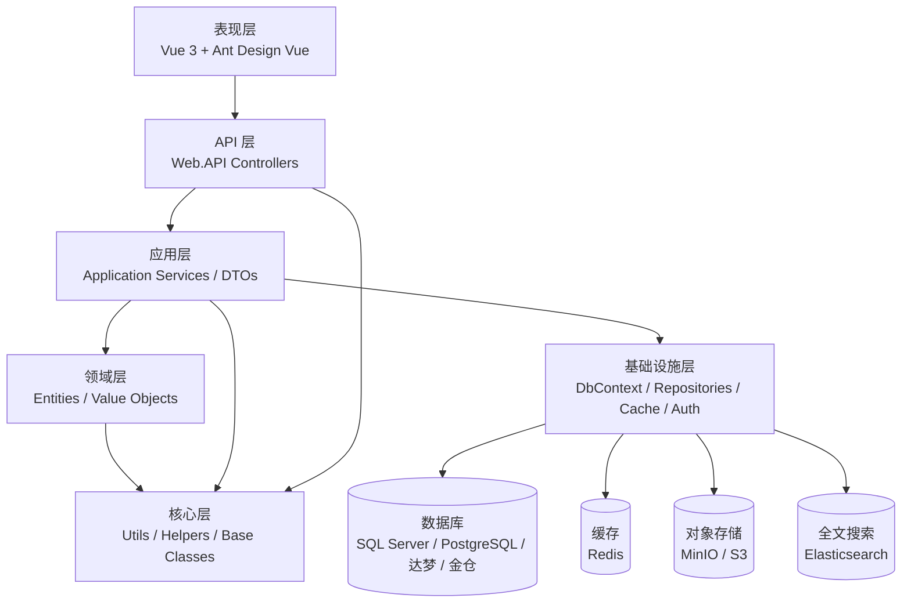
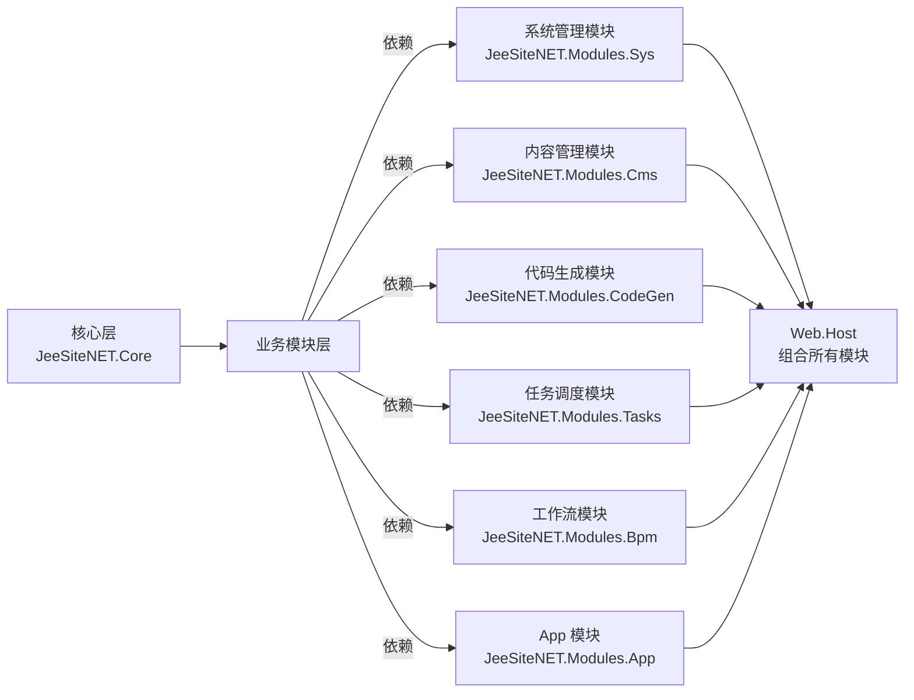
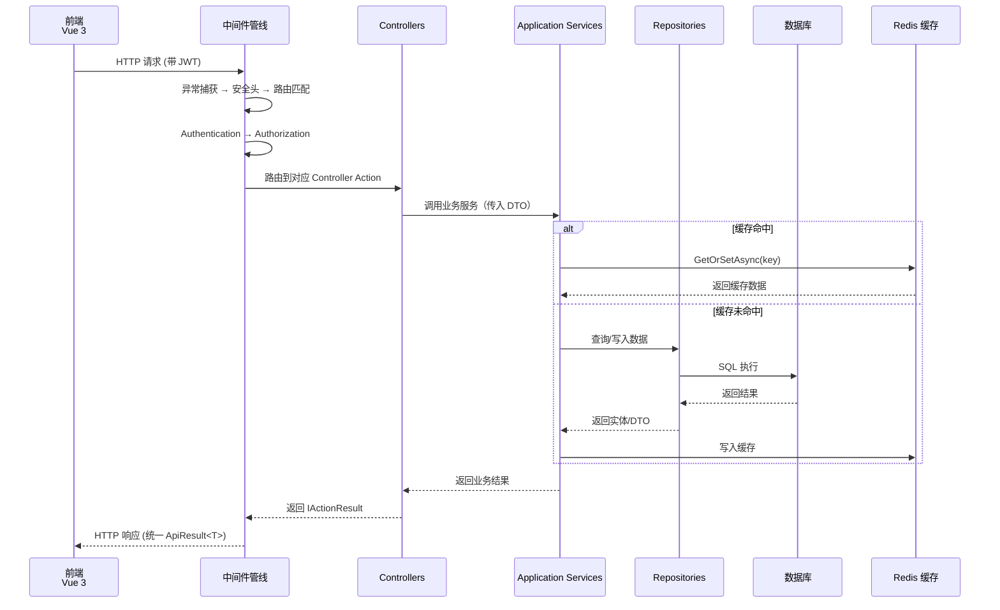

<div align="right">
  <a href="Home">← 返回首页</a>
</div>

---

# 02 系统架构概览

> 本文档从顶层介绍 JeeSite.NET 的系统架构、分层设计、模块划分、核心组件与数据流向。
> 最后更新: 2026-06-12

---

## 🏗️ 总体架构

JeeSite.NET 采用经典的**分层架构**设计，结合**模块化思想**，实现高度可扩展的企业级应用平台。



---

## 📚 分层说明

### 1. 核心层 (Core)

**位置**: `src/JeeSiteNET.Core/`

**职责**: 提供基础抽象和通用工具，不依赖任何业务项目。

**内容**:
- 统一响应类（`ApiResult`, `ApiResult<T>`）
- 分页基类（`PageRequest`, `PageResult`）
- 实体基类（`BaseEntity`, `DataEntity`, `TreeEntity`）
- 通用接口（`IRepository`, `ICrudService`）
- 模块化框架（`IModuleInstaller`, `ModuleLoader`）
- 安全抽象（`ICurrentUser`, `IDataScope`）
- 工具类（`EncryptUtil`, `ExcelService` 等 42+）

### 2. 基础设施层 (Infrastructure)

**位置**: `src/JeeSiteNET.Infrastructure/`

**职责**: 技术细节实现，依赖 Core 层。

**内容**:
- EF Core `JeeSiteDbContext`
- 数据库拦截器（审计/软删除/多租户/树形结构）
- 仓储实现基类
- FusionCache 双层缓存
- Redis/MinIO/Elasticsearch 集成
- 认证与授权

### 3. 模块层 (Modules)

**位置**: `modules/JeeSiteNET.Modules.*`

**职责**: 业务逻辑实现，每个模块内部遵循分层架构。

**结构**: 每个模块内部包含 Domain / Application / Infrastructure / Controllers

### 4. 表现层 (Presentation)

- **Web.API**: `src/JeeSiteNET.Web.Api/` — RESTful API 服务
- **Web.Host**: `src/JeeSiteNET.Web.Host/` — 全栈 Web 应用（可选）

---

## 📦 模块架构

### 模块列表

| 模块 | 编码 | 依赖 | 说明 |
|------|------|------|------|
| 系统管理 | Sys | Core | 用户、角色、权限、菜单、字典、组织机构 |
| 工作流 | Bpm | Core, Sys | 流程定义、实例、任务管理 |
| 内容管理 | Cms | Core, Sys | 站点、栏目、文章发布 |
| 代码生成 | CodeGen | Core, Sys | 在线建表、代码生成 |
| 任务调度 | Tasks | Core, Sys | 定时任务管理 |
| 应用管理 | App | Core, Sys | 应用升级、反馈 |

### 模块结构规范

```
JeeSiteNET.Modules.{Name}/
├── Domain/
│   ├── Entities/                    # 领域实体
│   ├── Interfaces/                  # 仓储接口
│   └── (可选) ValueObjects/Events/
├── Application/
│   ├── Services/                    # 应用服务
│   └── DTOs/                        # 数据传输对象
├── Infrastructure/
│   ├── EntityConfigurations/       # EF Core 配置
│   └── Repositories/               # 仓储实现
├── Controllers/                     # API 控制器
└── {Name}ModuleInstaller.cs         # 模块安装器
```

---

## 🔄 数据流向

### 请求处理流程

```
前端请求
    ↓
API Controller (参数校验、路由匹配)
    ↓
Application Service (业务逻辑、事务管理)
    ↓
Repository (数据访问、数据权限过滤)
    ↓
EF Core DbContext (ORM 映射)
    ↓
Database (SQL Server / Sqlite / PostgreSQL / ...)
```

### 响应返回流程

```
Database
    ↓
EF Core (实体映射)
    ↓
Repository (数据查询)
    ↓
Application Service (DTO 转换)
    ↓
API Controller (统一响应包装)
    ↓
ApiResult<T> (JSON 序列化)
    ↓
前端 (响应渲染)
```

### 认证授权流程

```
前端请求 (携带 Token)
    ↓
JWT Middleware (Token 解析)
    ↓
CurrentUser 注入 (用户信息)
    ↓
Permission Attribute (权限检查)
    ↓
Controller Action (业务处理)
```

---

## 🧩 核心组件

### 1. ApiResult<T> — 统一响应格式

所有 API 返回统一格式：

```csharp
public class ApiResult<T>
{
    public int Code { get; set; }         // 状态码
    public string Message { get; set; }   // 消息
    public T? Data { get; set; }          // 数据

    // 工厂方法
    public static ApiResult<T> Ok(T? data, string message)
    public static ApiResult<T> Fail(int code, string message)
    public static ApiResult<T> Unauthorized(string message)
    public static ApiResult<T> Forbidden(string message)
    public static ApiResult<T> NotFound(string message)
    public static ApiResult<T> Error(string message)
}
```

**错误码规范**：

| 错误码 | 含义 |
|--------|------|
| 200 | 成功 |
| 400 | 请求参数错误 |
| 401 | 未登录或登录过期 |
| 403 | 无操作权限 |
| 404 | 资源不存在 |
| 500 | 服务器内部错误 |

### 2. 实体基类体系

```csharp
// 基础接口
public interface IBaseEntity
{
    string? CreateBy { get; set; }
    DateTime? CreateDate { get; set; }
    string? UpdateBy { get; set; }
    DateTime? UpdateDate { get; set; }
    string? Remarks { get; set; }
}

public interface IDataEntity : IBaseEntity
{
    string? Status { get; set; }  // 0-正常, 1-禁用
}

public interface ITreeEntity
{
    string ParentCode { get; set; }
    string ParentCodes { get; set; }
    decimal TreeSort { get; set; }
    string TreeLeaf { get; set; }
    decimal TreeLevel { get; set; }
}

public interface ICorpEntity
{
    string? CorpCode { get; set; }
    string? CorpName { get; set; }
}
```

### 3. IRepository<T> — 仓储接口

```csharp
public interface IRepository<T> where T : class
{
    IQueryable<T> Query();
    Task<T?> GetAsync(object id);
    Task<List<T>> FindListAsync();
    Task AddAsync(T entity);
    Task UpdateAsync(T entity);
    Task DeleteAsync(T entity);
}
```

### 4. IModuleInstaller — 模块安装器

```csharp
public interface IModuleInstaller
{
    void ConfigureServices(IServiceCollection services, IConfiguration configuration);
}
```

**模块注册流程**:

```
应用启动 → ModuleLoader 扫描 → 发现 IModuleInstaller 实现
→ 调用每个 ConfigureServices → 注册服务到 DI 容器
```

### 5. ICurrentUser — 当前用户上下文

```csharp
public interface ICurrentUser
{
    string? UserCode { get; }
    string? LoginCode { get; }
    string? UserName { get; }
    string? CorpCode { get; }
    string? RoleCode { get; }
    List<string> Permissions { get; }
    bool IsAdmin { get; }
}
```

### 6. IDataScope — 数据权限服务

```csharp
public interface IDataScope
{
    IQueryable<T> ApplyDataScope<T>(IQueryable<T> query, string dataScopeType);
}
```

支持的数据权限类型：ALL / SELF / DEPT / DEPT_AND_CHILD / CUSTOM

### 7. FusionCache — 二级缓存

L1（内存） + L2（Redis）双层缓存，统一通过 `IFusionCache` 访问。

```csharp
var result = await _cache.GetOrSetAsync("cache_key",
    async () => await GetDataFromDb(), options);
```

### 8. EF Core 拦截器

系统内置以下拦截器：

| 拦截器 | 功能 |
|--------|------|
| `AuditInterceptor` | 自动记录审计日志 |
| `SoftDeleteInterceptor` | 软删除处理 |
| `CorpEntityInterceptor` | 多租户数据隔离 |
| `TreeEntityInterceptor` | 树结构自动维护 |

---

## 🎯 关键设计模式

### 1. 依赖注入 (Dependency Injection)

整个系统使用 ASP.NET Core DI 容器，模块通过 `IModuleInstaller` 自动注册服务。

### 2. 仓储模式 (Repository Pattern)

数据访问层抽象，隔离数据访问细节。

### 3. 服务定位器 (Service Locator)

通过 `ModuleLoader` 扫描所有模块，自动注册到 DI。

### 4. 拦截器模式 (Interceptor Pattern)

EF Core 拦截器实现审计、软删除、多租户、树结构等横切关注点。

### 5. 策略模式 (Strategy Pattern)

数据权限策略，根据不同的数据范围类型应用不同的过滤逻辑。

### 6. 观察者模式 (Observer Pattern)

事件通知机制，支持 SignalR 实时推送。

---

## 🌐 扩展机制

### 添加新模块

1. 在 `modules/` 下新建 `JeeSiteNET.Modules.{YourName}` 文件夹
2. 复制 `JeeSiteNET.Modules.App` 为骨架
3. 修改 csproj 中的 Assembly 名称
4. 按 `Domain/Entities → Domain/Interfaces → Infrastructure/Repositories → Application/Services → Controllers` 顺序编写
5. 在 `YourModuleInstaller.cs` 中注册依赖注入
6. 在数据库中添加菜单（sys_menu）
7. 重新编译并运行

### 扩展核心功能

- **实体扩展**: 继承 `BaseEntity` 或 `DataEntity`
- **仓储扩展**: 实现 `IRepository<T>` 或继承现有仓储
- **工具扩展**: 在 `JeeSiteNET.Core.Utils` 中添加新工具类
- **自定义认证**: 实现 `ICurrentUser` 接口替换默认实现
- **自定义存储**: 实现 `IFileStorageProvider` 接口

---

## 🏗️ 架构与数据流

### 模块依赖关系图



### 请求数据流图



---

## 📖 相关文档

- [Sys系统管理模块](03-Sys系统管理模块) — 核心业务模块详解
- [深入架构剖析](33-深入架构剖析) — 启动流程、中间件、多租户、安全纵深防御
- [API接口规范](31-API接口规范) — RESTful API 设计
- [开发规范与最佳实践](30-开发规范与最佳实践) — 编码规范与项目结构
- [部署与运维指南](32-部署与运维指南) — 生产部署

---

<div align="center">
  <small>本文档最后更新: 2026-06-12 · JeeSite.NET Wiki</small>
</div>
