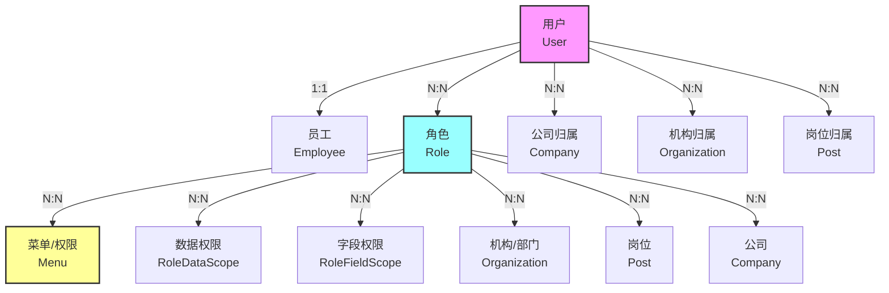
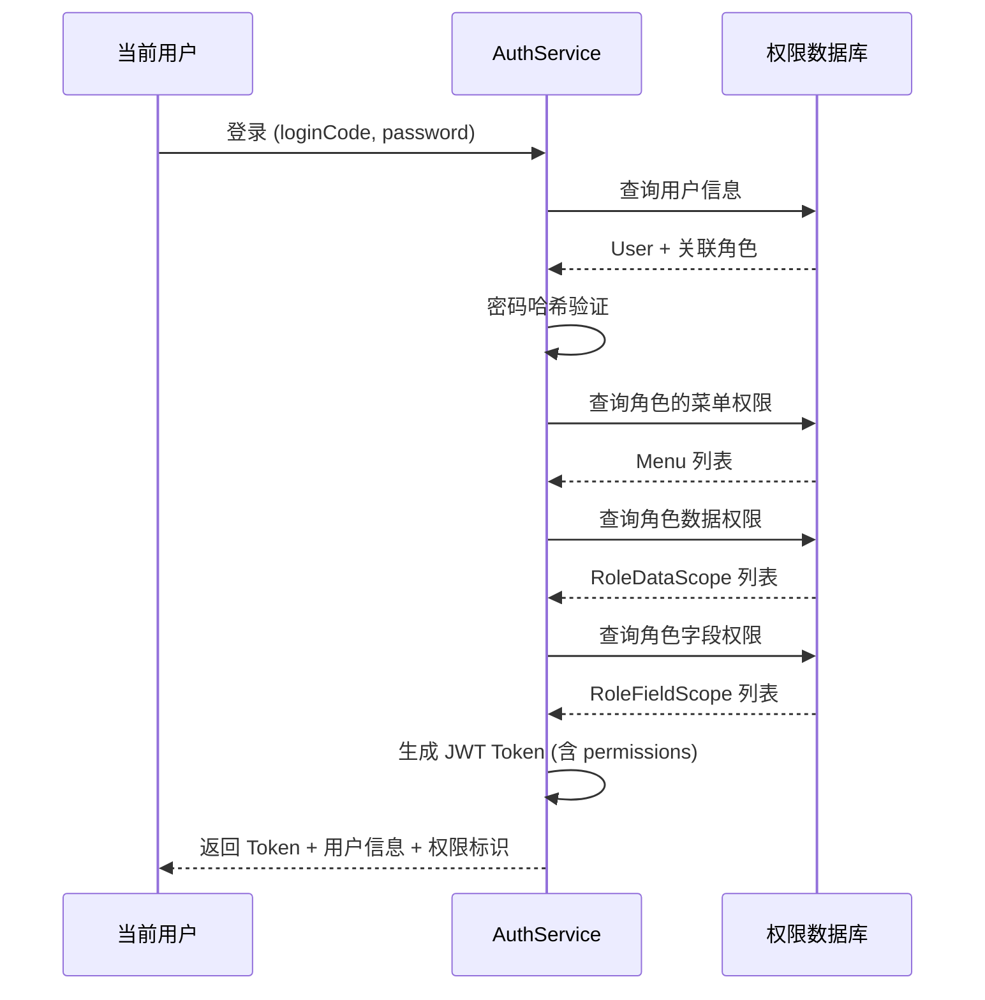

<div align="right">
  <a href="Home">← 返回首页</a>
</div>

---

# 03 Sys系统管理

> 用户、角色、菜单、机构、公司、岗位、字典、配置、消息、审计、日志、在线用户等系统管理模块。
>
> **适用角色**：系统管理员、开发人员
> **阅读时间**：约 12 分钟
> **相关文档**：[15-JWT认证](15-JWT认证) · [19-数据与字段权限](19-数据与字段权限)
> 最后更新: 2026-06-13

---

## 📋 目录

- [一、模块概述](#一、模块概述)
  - [1.1 模块定位](#11-模块定位)
  - [1.2 与其他模块的依赖关系](#12-与其他模块的依赖关系)
- [二、实体类清单](#二、实体类清单)
- [三、服务层清单](#三、服务层清单)
  - [3.1 用户与认证](#31-用户与认证)
  - [3.2 角色与菜单](#32-角色与菜单)
  - [3.3 组织架构](#33-组织架构)
  - [3.4 基础数据](#34-基础数据)
  - [3.5 日志、审计、监控](#35-日志、审计、监控)
  - [3.6 文件与预览](#36-文件与预览)
  - [3.7 消息与通知](#37-消息与通知)
  - [3.8 外部认证集成](#38-外部认证集成)
  - [3.9 邮件与短信](#39-邮件与短信)
- [四、控制器与 API](#四、控制器与-api)
  - [4.1 认证与会话](#41-认证与会话)
  - [4.2 用户与员工](#42-用户与员工)
  - [4.3 角色、菜单、权限](#43-角色、菜单、权限)
  - [4.4 组织、公司、岗位、地区、业务分类](#44-组织、公司、岗位、地区、业务分类)
  - [4.5 字典、参数、模块、多语言、租户](#45-字典、参数、模块、多语言、租户)
  - [4.6 日志、审计、在线、缓存、监控、搜索](#46-日志、审计、在线、缓存、监控、搜索)
  - [4.7 消息与通知](#47-消息与通知)
  - [4.8 文件、预览与富文本](#48-文件、预览与富文本)
  - [4.9 导入导出、邮件、短信](#49-导入导出、邮件、短信)
  - [4.10 安全与企业管理](#410-安全与企业管理)
- [五、前端页面清单](#五、前端页面清单)
- [六、扩展与二次开发](#六、扩展与二次开发)
  - [6.1 新增一个系统管理类功能的标准路径](#61-新增一个系统管理类功能的标准路径)
  - [6.2 扩展数据权限](#62-扩展数据权限)
  - [6.3 扩展字段权限](#63-扩展字段权限)
  - [6.4 新增消息模板与推送](#64-新增消息模板与推送)
  - [6.5 接入文件上传/预览](#65-接入文件上传-预览)

---


## 一、模块概述

### 1.1 模块定位

Sys 模块是 JeeSite.NET 的核心权限管理与系统基础数据模块，提供用户管理、角色管理、菜单路由、组织机构、公司、岗位、地区、字典、参数配置、模块管理、日志、审计、站内消息、消息推送、消息模板、多语言、多租户、数据权限、字段权限等基础能力。它是业务模块（如 CMS、App、Bpm）的依赖基础，所有业务模块在权限与用户体系上都建立在 Sys 模块之上。

关键职责：

- **认证与会话**：登录、登出、菜单路由、Token 生成与校验、OAuth2 / CAS / LDAP 集成。
- **权限体系**：RBAC 角色菜单授权 + 数据权限（行级）+ 字段权限（列级）。
- **用户与组织**：用户、公司、部门、岗位、员工、员工-用户、租户的完整生命周期。
- **基础数据**：字典、参数配置、模块注册、多语言词条。
- **运营与监控**：操作日志、审计记录、在线用户、缓存管理、服务监控、MCP 接入、文件上传与预览、Excel 导入导出、邮件/短信、搜索与全文检索。
- **消息与通知**：站内消息、消息推送、消息模板。

### 1.2 与其他模块的依赖关系

```
JeeSiteNET.Modules.Sys
  ├─ 依赖 JeeSiteNET.Core（通用仓储、实体基类、工具）
  └─ 被以下模块依赖
      ├─ JeeSiteNET.Modules.Cms（内容管理，使用 Sys 的用户/角色/菜单/日志）
      ├─ JeeSiteNET.Modules.App（App 升级与评论）
      ├─ JeeSiteNET.Modules.Bpm（工作流，使用员工、用户、权限）
      └─ JeeSiteNET.Modules.CodeGen（代码生成器，使用菜单/模块）
```

主要对外能力：

- 认证与授权：`AuthService`、`ValidCodeService`、`OAuth2Service`、`CasAuthService`、`LdapAuthService`
- 权限查询：`RoleService`、`RoleMenuService`、`RoleDataScopeService`、`RoleFieldScopeService`、`MenuService`
- 用户与组织：`UserService`、`OrganizationService`、`CompanyService`、`PostService`、`EmployeeService`、`EmpUserController`
- 基础数据：`DictTypeService`、`DictDataService`、`ConfigService`、`ModuleService`、`AreaService`、`LangService`、`TenantService`
- 监控与运营：`LogService`、`AuditService`、`MonitorService`、`DashboardService`、`CacheController`、`OnlineController`、`SearchService`
- 文件与预览：`FileService`、`ChunkUploadService`、`PreviewService`（含 LibreOffice 转换）
- 消息：`MsgService`
- 导入导出：`ExcelController`
- 邮件与短信：`EmailService` / `SmsService`
- 用户门户：`ProfileController`

## 二、实体类清单

所有实体位于命名空间 `JeeSiteNET.Modules.Sys.Domain.Entities`。以下仅列出每个实体的核心字段（3-5 个）与主键/关键索引。

| 实体 | 主键 | 核心字段 |
|------|------|----------|
| **User** | `UserCode` | `LoginCode`（登录名）、`UserName`、`Password`（已加密）、`UserType`（employee/admin）、`OrgCode`（所属机构） |
| **Role** | `RoleCode` | `RoleName`、`RoleType`、`IsSys`（是否系统角色）、`IsShow`、`DataScope`（数据权限范围） |
| **Menu** | `MenuCode` | `MenuName`、`MenuType`（目录/菜单/按钮）、`MenuHref`、`Permission`（权限表达式）、`SysCode`（所属系统标识）|
| **Organization** | `OrgCode` | `OrgName`、`OrgType`、`Leader`、`FullName`（完整名称）、`Phone` |
| **Company** | `CompanyCode` | `CompanyName`、`FullName`、`AreaCode`（所属地区）、`AreaName` |
| **Post** | `PostCode` | `PostName`、`PostType`、`OrgCode`、`PostSort` |
| **Area** | `AreaCode` | `AreaName`、`AreaType`（省/市/县…）、`ParentCode`（TreeEntity 树） |
| **DictType** | `DictTypeCode` | `DictName`、`IsSys`、`Sort` |
| **DictData** | `DictCode` | `DictType`（所属字典类型）、`DictLabel`、`DictValue`、`Description`、`CssClass` |
| **Config** | `ConfigKey` | `ConfigName`、`ConfigValue`、`IsSys` |
| **Module** | `ModuleCode` | `ModuleName`、`Description`、`ModuleVersion`、`MainClass`、`PackageName`、`IsEnabled` |
| **Log** | `LogId` | `LogType`、`LogTitle`、`RequestUri`、`RequestMethod`、`BizKey`、`UserCode`、`RemoteIp`、`ExecuteTime` |
| **Audit** | `AuditId` | `AuditType`、`AuditResult`、`UserCode`、`LoginCode`、`OfficeCode`、`MenuCode`、`PwdSecurityLevel` |
| **MsgInner** | `Id` | `MsgTitle`、`ContentLevel`、`MsgContent`、`ReceiveType`、`SendUserCode`、`SendDate` |
| **MsgInnerRecord** | `Id` | `MsgInnerId`、`ReceiveUserCode`、`ReadStatus`、`ReadDate` |
| **MsgPush** | `Id` | `MsgType`、`MsgTitle`、`MsgContent`、`ReceiveCode`、`PushStatus`、`PushDate`、`ReadStatus` |
| **MsgPushed** | `Id` | `MsgType`、`MsgTitle`、`MsgContent`、`ReceiveCode`、`PushStatus`、`PushDate`（与 MsgPush 结构相同，用于归档/历史） |
| **MsgTemplate** | `Id` | `ModuleCode`、`TplKey`、`TplName`、`TplType`、`TplContent` |
| **Lang** | `Id` | `ModuleCode`、`LangCode`（如 zh-CN/en-US）、`LangText`、`LangType`（前端/后端） |
| **Tenant** | `TenantCode` | `TenantName`、`ContactName`、`ContactPhone`、`ExpireDate`、`IsAvailable` |
| **MenuDataScope** | `Id` | `MenuCode`、`RuleName`、`RuleType`、`RuleConfig`（菜单级预设数据权限规则） |
| **RoleDataScope** | `Id` | `RoleCode`、`MenuCode`、`RuleName`、`RuleType`、`RuleConfig`（角色-菜单级生效的数据权限） |
| **RoleFieldScope** | `Id` | `RoleCode`、`MenuCode`、`EntityName`、`EntityClass`、`FieldConfig`（角色-菜单级生效的字段可见/不可见） |
| **RoleMenu** | 无独立主键（`RoleCode`+`MenuCode`） | `RoleCode`、`MenuCode`（RBAC 关系表） |
| **UserRole** | 无独立主键（`UserCode`+`RoleCode`） | `UserCode`、`RoleCode`（用户-角色关系） |
| **Employee** | `EmpCode` | `EmpName`、`OrgCode`、`CompanyCode`、`Post` |
| **EmployeeOffice** | 无独立主键 | `EmpCode`、`OrgCode` |
| **EmployeePost** | 无独立主键 | `EmpCode`、`PostCode` |
| **EmpUser** | 无独立主键 | `EmpCode`、`UserCode`（员工与用户账号关联） |
| **FileEntity** | `FileId` | `FileName`、`FilePath`、`FileSize`、`BizType`、`BizKey` |
| **FileUpload** | `UploadId` | `FileName`、`FileSize`、`ContentType`、`Md5`、`ChunkIndex`、`TotalChunks` |
| **BizCategory** | `CategoryCode` | `CategoryName`、`CategoryType`、`BizCode`（业务侧分类，由 BizCategoryController 维护） |

> **主键策略约定**：所有业务主键采用 `string` 型业务编码（如 `UserCode`、`RoleCode`），系统内部通过 `IdGenerator.NewId()` 生成雪花/有序 ID。关系表（`RoleMenu`、`UserRole`、`EmployeeOffice`、`EmployeePost`、`EmpUser`）以组合外键为主键。

## 三、服务层清单

每个服务列出 3-5 个核心方法签名与作用。所有服务位于 `JeeSiteNET.Modules.Sys.Application.Services`。

### 3.1 用户与认证

| 服务 | 方法签名 | 作用 |
|------|---------|------|
| **UserService** | `GetAsync(string userCode) -> UserDto?` | 按 UserCode 查询用户 |
| | `GetByLoginCodeAsync(string loginCode) -> UserDto?` | 按登录名查询用户 |
| | `FindPageAsync(PageRequest<User> request) -> PageResult<UserDto>` | 分页查询（应用数据权限过滤） |
| | `SaveAsync(UserSaveDto dto) -> ApiResult` | 新建/更新用户，自动维护角色关系 |
| | `GetPermissionsAsync(string userCode) -> List<string>` | 获取用户所有权限字符串 |
| **AuthService** | `LoginAsync(LoginDto dto) -> ApiResult<LoginResultDto>` | 常规账号密码登录，颁发 JWT Token |
| | `LoginByCodeAsync(string target, string code) -> ApiResult<LoginResultDto>` | 凭手机号/邮箱 + 验证码登录 |
| | `GetAuthInfoAsync() -> ApiResult<object>` | 获取当前登录用户的完整信息（含角色/系统编码） |
| | `GetMenuRouteAsync(string? sysCode) -> ApiResult<List<MenuDto>>` | 按用户权限构建前端动态菜单树 |
| **ValidCodeService** | `GenerateAndSendAsync(string target, string scene) -> ApiResult` | 生成并（模拟）发送短信/邮件验证码 |
| | `VerifyAsync(string target, string scene, string code) -> ApiResult` | 校验验证码 |
| | `VerifySilentAsync(...) -> bool` | 仅校验不删除（场景如防刷） |

### 3.2 角色与菜单

| 服务 | 方法签名 | 作用 |
|------|---------|------|
| **RoleService** | `GetAsync(string roleCode) -> RoleDto?` | 获取单个角色 |
| | `FindPageAsync(PageRequest<Role>) -> PageResult<RoleDto>` | 分页查询 |
| | `SaveAsync(RoleSaveDto) -> ApiResult` | 新建/更新角色 |
| | `DeleteAsync(string roleCode) -> ApiResult` | 删除角色 |
| **MenuService** | `GetUserMenusAsync(string? sysCode) -> List<MenuDto>` | 按当前用户权限获取菜单 |
| | `FindTreeAsync() -> List<MenuDto>` | 获取完整菜单树 |
| | `GetSysCodesAsync() -> List<string>` | 获取所有系统标识 |
| | `FixTreeDataAsync() -> ApiResult` | 修复树左右值/层级 |
| **RoleMenuService** | `GetMenusByRole(string roleCode) -> List<string>` | 角色已授权菜单集合 |
| **RoleDataScopeService** | `GetRulesByRoleMenu(string roleCode, string menuCode) -> List<...>` | 查询数据权限规则 |
| **RoleFieldScopeService** | `GetFieldsByRoleMenu(string roleCode, string menuCode) -> ...` | 查询字段权限规则 |

### 3.3 组织架构

| 服务 | 方法签名 | 作用 |
|------|---------|------|
| **OrganizationService** | `GetTreeAsync() -> List<OrganizationDto>` | 部门树 |
| | `SaveAsync(OrganizationSaveDto) -> ApiResult` | 新建/更新部门 |
| **CompanyService** | `TreeAsync() -> List<CompanyDto>` | 公司树 |
| | `GetAsync(string companyCode) -> CompanyDto?` | 公司信息 |
| **PostService** | `FindPageAsync(PageRequest<Post>) -> PageResult<PostDto>` | 岗位分页 |
| **EmployeeService** | `FindPageAsync(PageRequest<Employee>) -> PageResult<EmployeeDto>` | 员工分页 |
| | `SaveAsync(EmployeeSaveDto) -> ApiResult` | 保存员工（含岗位/部门） |
| **AreaService** | `TreeAsync() -> List<AreaDto>` | 地区树（省/市/县） |

### 3.4 基础数据

| 服务 | 方法签名 | 作用 |
|------|---------|------|
| **DictTypeService** | `FindPageAsync(...) -> PageResult<DictTypeDto>` | 字典类型分页 |
| **DictDataService** | `TreeAsync(string dictType) -> List<DictDataDto>` | 字典项按类型构建树 |
| | `GetByTypeAsync(string dictType) -> List<DictDataDto>` | 取某类型下所有字典项 |
| **ConfigService** | `GetValueAsync(string configKey) -> string?` | 获取系统参数值 |
| **ModuleService** | `GetAllAsync() -> List<ModuleDto>` | 获取所有已注册模块 |
| **LangService** | `FindByModuleAndLang(string module, string lang) -> List<LangDto>` | 按模块和语言获取词条 |
| **TenantService** | `GetAsync(string tenantCode) -> TenantDto?` | 租户详情 |

### 3.5 日志、审计、监控

| 服务 | 方法签名 | 作用 |
|------|---------|------|
| **LogService** | `FindPageAsync(PageRequest<Log>) -> PageResult<LogDto>` | 操作日志分页 |
| | `SaveAsync(Log entity) -> ApiResult` | 写入操作日志 |
| **AuditService** | `FindPageAsync(PageRequest<Audit>) -> PageResult<Audit>` | 审计日志分页 |
| | `FindListAsync(Audit criteria) -> List<Audit>` | 按条件查询审计列表 |
| **MonitorService** | `GetServerInfo() -> ServerInfo` | CPU / 内存 / 磁盘使用情况 |
| **DashboardService** | `GetStatsAsync() -> DashboardStats` | 用户数、今日登录、角色数等首页数据 |
| **SearchService** | `SearchAsync(SearchQuery query) -> SearchResult<object>` | 全文检索入口 |
| | `ReindexAllAsync() -> Task` | 重建索引 |

### 3.6 文件与预览

| 服务 | 方法签名 | 作用 |
|------|---------|------|
| **FileService** | `UploadAsync(IFormFile file, string? bizType, string? bizKey) -> ApiResult<FileUploadResult>` | 上传文件，记录 bizKey 关联 |
| | `GetDownloadAsync(string uploadId) -> FileDownloadResult?` | 下载文件元数据与流 |
| | `CheckMd5ExistAsync(string md5) -> FileExistResult?` | MD5 秒传检测 |
| **ChunkUploadService** | `InitAsync(ChunkInitRequest) -> ChunkInitResult` | 初始化分片上传会话 |
| | `MergeAsync(string uploadId, ...) -> ApiResult<FileUploadResult>` | 合并分片并生成最终文件 |
| **PreviewService** | `ConvertToPdfAsync(string uploadId) -> PreviewResult?` | 调用 LibreOffice 将 Office 文档转 PDF |

### 3.7 消息与通知

| 服务 | 方法签名 | 作用 |
|------|---------|------|
| **MsgService** | `SendAsync(MsgInnerSaveDto dto) -> ApiResult` | 发送站内消息，生成接收记录 |
| | `GetInboxAsync(string userCode, PageRequest) -> PageResult<MsgInnerRecordDto>` | 收件箱分页 |
| | `GetSentAsync(string userCode, PageRequest) -> PageResult<MsgInnerDto>` | 已发消息分页 |
| | `MarkReadAsync(string recordId) -> ApiResult` | 标记已读 |
| | `SendPushAsync(MsgPushSaveDto dto) -> ApiResult` | 创建推送消息（短信/推送通道） |
| | `SaveTemplateAsync(MsgTemplateSaveDto dto) -> ApiResult` | 保存消息模板 |

### 3.8 外部认证集成

| 服务 | 方法签名 | 作用 |
|------|---------|------|
| **OAuth2Service** | `LoginAsync(string provider, string code, string redirectUri) -> ApiResult<LoginResultDto>` | 统一第三方登录回调入口 |
| **CasAuthService** | `CasLoginAsync(string ticket, string serviceUrl) -> ApiResult<LoginResultDto>` | CAS 票据验证 |
| **LdapAuthService** | `LdapLoginAsync(LoginDto dto) -> ApiResult<LoginResultDto>` | LDAP bind 并同步本地账号 |

### 3.9 邮件与短信

| 服务 | 方法签名 | 作用 |
|------|---------|------|
| **EmailService** | `SendAsync(string toAddress, string subject, string body, ...) -> bool` | 发送邮件 |
| **SmsService** | `SendAsync(string phoneNumber, string message) -> bool` | 发送短信 |

## 四、控制器与 API

所有控制器默认路由命名空间：`api/v1/sys/...`。以下按业务分组列出核心端点。

### 4.1 认证与会话

| 控制器 | Route | 核心 HTTP 方法 |
|--------|-------|---------------|
| **AuthController** | `api/v1/sys/auth` | `POST /login`（账号密码登录）、`POST /register`、`POST /forgot-password`、`POST /reset-password`、`GET /auth-info`、`GET /menu-route?sysCode=...`、`POST /login-by-code` |
| **AccountController** | `api/v1/sys/account` | `GET /security-info`、`POST /set-password-question`、`POST /send-valid-code`、`POST /verify-valid-code`、`POST /login-by-code`、`POST /reset-password-by-code`、`POST /unlock-user` |
| **OAuth2Controller** | `api/v1/sys/auth/oauth2` | `GET /redirect/{provider}`、`GET /callback?provider=&code=&state=`（GitHub/钉钉/微信） |
| **CasAuthController** | `api/v1/sys/auth` | `GET /cas?ticket=&serviceUrl=` |
| **LdapAuthController** | `api/v1/sys/auth` | `POST /ldap`（LDAP 账号登录） |
| **ValidCodeController** | `api/v1/sys/validCode` | `GET /image?key=`（图形验证码）、`POST /send`、`POST /verify` |

### 4.2 用户与员工

| 控制器 | Route | 核心 HTTP 方法 |
|--------|-------|---------------|
| **UserController** | `api/v1/sys/user` | `POST /list`（分页）、`GET /get?userCode=`、`POST /save`、`POST /delete`、`GET /permissions?userCode=` |
| **EmployeeController** | `api/v1/sys/employee` | `POST /list`、`GET /get?empCode=`、`POST /save`、`POST /delete` |
| **EmpUserController** | `api/v1/sys/emp-user` | `GET /list-by-emp?empCode=`、`GET /list-by-user?userCode=`、`POST /save`、`POST /delete`、`GET /available-employees`、`GET /available-users`、`GET /export`、`POST /import` |
| **ProfileController** | `api/v1/sys/profile` | `GET /`（个人资料）、`POST /update`、`POST /change-password`、`POST /update-avatar`、`GET /desktop`（个人桌面/统计） |

### 4.3 角色、菜单、权限

| 控制器 | Route | 核心 HTTP 方法 |
|--------|-------|---------------|
| **RoleController** | `api/v1/sys/role` | `POST /list`、`GET /get?roleCode=`、`POST /save`、`POST /delete` |
| **RoleMenuController** | `api/v1/sys/role-menu` | `GET /by-role?roleCode=`、`POST /save`、`POST /delete` |
| **RoleDataScopeController** | `api/v1/sys/role-data-scope` | `GET /by-role?roleCode=&menuCode=`、`POST /save`、`POST /delete` |
| **RoleFieldScopeController** | `api/v1/sys/role-field-scope` | `GET /by-role?roleCode=&menuCode=`、`POST /save`、`POST /delete` |
| **MenuController** | `api/v1/sys/menu` | `POST /list`、`GET /tree?moduleCode=`、`GET /get?menuCode=`、`POST /save`、`POST /delete`、`GET /user-menus?sysCode=`、`GET /sys-codes`、`POST /fix-tree` |
| **MenuDataScopeController** | `api/v1/sys/menu-data-scope` | `GET /by-menu?menuCode=`、`POST /save`、`POST /delete` |
| **RoleUserController** | `api/v1/sys/role` | `GET /users-by-role?roleCode=`、`POST /assign-users`、`POST /unassign-users` |
| **SwitchController** | `api/v1/sys/switch` | `POST /role?roleCode=`（切换当前登录身份的角色视角） |

### 4.4 组织、公司、岗位、地区、业务分类

| 控制器 | Route | 核心 HTTP 方法 |
|--------|-------|---------------|
| **OrganizationController** | `api/v1/sys/org` | `GET /tree?orgType=`、`GET /get?orgCode=`、`POST /save`、`POST /delete`、`GET /export`、`POST /import` |
| **CompanyController** | `api/v1/sys/company` | `GET /tree`、`GET /get?companyCode=`、`POST /save`、`POST /delete` |
| **PostController** | `api/v1/sys/post` | `POST /list`、`GET /get?postCode=`、`POST /save`、`POST /delete` |
| **AreaController** | `api/v1/sys/area` | `GET /tree`、`POST /save`、`POST /delete` |
| **BizCategoryController** | `api/v1/sys/biz-category` | `POST /list`、`GET /get?categoryCode=`、`POST /save`、`POST /delete` |

### 4.5 字典、参数、模块、多语言、租户

| 控制器 | Route | 核心 HTTP 方法 |
|--------|-------|---------------|
| **DictTypeController** | `api/v1/sys/dict-type` | `POST /list`、`GET /get?dictTypeCode=`、`POST /save`、`POST /delete` |
| **DictDataController** | `api/v1/sys/dict-data` | `POST /list`、`GET /tree?dictType=`、`GET /by-type?dictType=`、`POST /save`、`POST /delete` |
| **ConfigController** | `api/v1/sys/config` | `POST /list`、`GET /get?configKey=`、`POST /save`、`POST /delete` |
| **ModuleController** | `api/v1/sys/module` | `POST /list`、`GET /get?moduleCode=`、`POST /save`、`POST /delete` |
| **LangController** | `api/v1/sys/lang` | `POST /list`、`GET /get?id=`、`POST /save`、`POST /delete` |
| **TenantController** | `api/v1/sys/tenant` | `POST /list`、`GET /get?tenantCode=`、`POST /save`、`POST /delete` |

### 4.6 日志、审计、在线、缓存、监控、搜索

| 控制器 | Route | 核心 HTTP 方法 |
|--------|-------|---------------|
| **LogController** | `api/v1/sys/log` | `POST /list`、`GET /get?logId=`、`POST /delete` |
| **AuditController** | `api/v1/sys/audit` | `POST /list`、`GET /export`、`GET /user-permissions?loginCode=`、`GET /menu-permissions?userCode=` |
| **OnlineController** | `api/v1/sys/online` | `GET /list`、`POST /kick?userCode=`（踢出在线用户） |
| **CacheController** | `api/v1/sys/cache` | `GET /keys`、`GET /get?key=`、`POST /clear`、`POST /remove?key=` |
| **MonitorController** | `api/v1/sys/monitor` | `GET /server`（CPU/内存/磁盘）、`GET /health` |
| **DashboardController** | `api/v1/sys/dashboard` | `GET /stats`、`GET /recent-logins` |
| **SearchController** | `api/v1/sys/search` | `POST /search`（全文检索）、`POST /reindex`、`GET /ping` |
| **McpController** | `api/v1/mcp` | `GET /`（MCP 服务信息）、`POST /`（JSON-RPC 2.0 工具调用入口） |

### 4.7 消息与通知

| 控制器 | Route | 核心 HTTP 方法 |
|--------|-------|---------------|
| **MsgController** | `api/v1/sys/msg` | `GET /inbox`、`GET /sent`、`POST /send`、`POST /mark-read`、`POST /delete`、`POST /save-template`、`GET /template?tplKey=` |
| **MsgPushController** | `api/v1/sys/msg/push` | `POST /list`、`POST /send`、`POST /retry` |

### 4.8 文件、预览与富文本

| 控制器 | Route | 核心 HTTP 方法 |
|--------|-------|---------------|
| **FileController** | `api/v1/sys/file` | `POST /upload`、`GET /download?uploadId=`、`GET /by-biz?bizType=&bizKey=`、`POST /delete?uploadId=`、`POST /chunk-init`、`POST /chunk-upload?uploadId=&chunkIndex=`、`POST /chunk-merge?uploadId=` |
| **UserfilesController** | `api/v1/sys/userfiles` | `GET /list?bizType=`（用户本人文件）、`POST /upload`、`POST /delete`、`GET /preview?uploadId=` |
| **EditorController** | `api/v1/sys/editor` | `POST /upload`（编辑器图片上传）、`GET /upload-image`、`POST /ueditor?action=`（兼容 UEditor） |
| **PreviewController** | `api/v1/sys/preview` | `GET /?uploadId=`（通用预览）、`GET /thumbnail?uploadId=&width=&height=`、`GET /pdf?uploadId=` |

### 4.9 导入导出、邮件、短信

| 控制器 | Route | 核心 HTTP 方法 |
|--------|-------|---------------|
| **ExcelController** | `api/v1/sys/excel` | `GET /export?type=`、`POST /import?type=`（带文件）、`GET /template?type=` |
| **EmailController** | `api/v1/sys/email` | `POST /send` |
| **SmsController** | `api/v1/sys/sms` | `POST /send` |

### 4.10 安全与企业管理

| 控制器 | Route | 核心 HTTP 方法 |
|--------|-------|---------------|
| **SecAdminController** | `api/v1/sys/sec-admin` | `POST /lock-user?userCode=`、`POST /unlock-user?userCode=`、`GET /audit-logs?days=`、`GET /access-logs?days=`、`GET /frozen-users` |
| **CorpAdminController** | `api/v1/sys/corp-admin` | `GET /users`、`GET /roles`、`GET /orgs` |

## 五、前端页面清单

前端项目位于 `frontend/src/views/sys`。核心页面与简要说明如下：

| 页面文件 | 说明 |
|---------|------|
| `Login.vue` | 登录页（账号密码 + 图形验证码 + 第三方登录入口） |
| `Dashboard.vue` | 工作台/首页，展示统计卡、最近登录、快速入口 |
| `UserList.vue` | 用户管理（新增/编辑/停用/分配角色/重置密码） |
| `RoleList.vue` | 角色管理（含菜单授权、数据权限、字段权限） |
| `MenuList.vue` | 菜单管理（树形结构，增删改，权限表达式维护） |
| `OrgTree.vue` | 部门树维护 |
| `CompanyTree.vue` | 公司树维护 |
| `PostList.vue` | 岗位管理 |
| `AreaTree.vue` | 行政区划（省市区县） |
| `DictList.vue` | 字典管理（类型+字典项两级） |
| `ConfigList.vue` | 系统参数配置 |
| `ModuleList.vue` | 模块注册与版本管理 |
| `LogList.vue` | 操作日志（按条件检索、导出） |
| `AuditList.vue` | 审计日志与权限审计（按用户/菜单） |
| `LangList.vue` | 多语言词条维护 |
| `MsgInbox.vue` | 站内消息收件箱 |
| `MsgSent.vue` | 站内消息发送历史 |
| `MsgTemplateList.vue` | 消息模板管理 |
| `MsgPushList.vue` | 消息推送记录与重试 |
| `OnlineUserList.vue` | 在线用户列表（支持踢出） |
| `CacheList.vue` | 缓存管理（查看/清空/按 Key 删除） |
| `MonitorServer.vue` | 服务器监控（CPU/内存/磁盘实时数据） |
| `Profile.vue` | 个人中心（修改资料、密码、头像、桌面） |
| `RoleDataScope.vue` | 角色级数据权限配置（按菜单配置规则） |
| `RoleFieldScope.vue` | 角色级字段权限配置（按实体配置字段可见性） |
| `EmployeeList.vue` | 员工管理 |
| `FileList.vue` | 文件管理（按业务类型列出） |
| `BizCategoryTree.vue` | 业务侧分类树 |

所有页面通过 `api/v1/sys/*` 对应控制器获取数据，并利用 `usePermission`（`composables/usePermission.ts`）统一处理权限表达式隐藏。

## 六、扩展与二次开发

### 6.1 新增一个系统管理类功能的标准路径

**步骤 1：定义实体（Domain）**

在 `JeeSiteNET.Modules.Sys.Domain/Entities/` 下新建 `YourEntity.cs`。推荐继承 `DataEntity`（自动包含 `Status`、`CreateDate`、`UpdateDate`、`CreateBy`、`UpdateBy`），若为树结构继承 `TreeEntity`。若属于某租户/公司，实现 `ICorpEntity`。

```csharp
public class YourEntity : DataEntity, ICorpEntity
{
    public string Code { get; set; } = string.Empty;
    public string Name { get; set; } = string.Empty;
    public string? CorpCode { get; set; }
    public string? CorpName { get; set; }
}
```

**步骤 2：定义仓储接口与实现**

在 `Domain/Interfaces/IYourRepository.cs` 定义仓储接口，在 `Infrastructure/Repositories/YourRepository.cs` 实现，一般继承 `Core` 提供的 `IRepository<T>` 基类即可。

**步骤 3：编写服务（Application/Services）**

遵循 `FindPageAsync / GetAsync / SaveAsync / DeleteAsync` 四段式方法签名，入参使用 `PageRequest<T>`、`YourSaveDto`，返回使用 `ApiResult` / `PageResult<T>`：

```csharp
public class YourService
{
    public async Task<PageResult<YourDto>> FindPageAsync(PageRequest<YourEntity> request) { ... }
    public async Task<ApiResult> SaveAsync(YourSaveDto dto) { ... }
}
```

**步骤 4：新增控制器（Controllers）**

约定路由 `api/v1/sys/your`，按列表/详情/保存/删除 四个动作暴露：

```csharp
[Route("api/v1/sys/your")]
public class YourController : ControllerBase
{
    [HttpPost("list")] public async Task<ApiResult<PageResult<YourDto>>> List([FromBody] PageRequest<YourEntity> request) => ...;
    [HttpGet("get")]  public async Task<ApiResult<YourDto?>> Get([FromQuery] string code) => ...;
    [HttpPost("save")] public async Task<ApiResult> Save([FromBody] YourSaveDto dto) => ...;
    [HttpPost("delete")] public async Task<ApiResult> Delete([FromBody] DeleteYourRequest request) => ...;
}
```

**步骤 5：注册菜单与权限**

- 在 `Menu` 实体中新增一条菜单记录（或通过 `ModuleManager` 注册到某模块）。
- 为每条接口定义 `Permission` 表达式（如 `sys:your:view, sys:your:edit`）。
- 角色侧通过 `RoleList.vue` 对该菜单勾选授权。

**步骤 6：前端页面**

在 `frontend/src/views/sys/` 下新增 `YourList.vue`：使用统一的 `el-table` + `PageRequest` 分页组件，调用 `frontend/src/api/your.ts`。

**步骤 7：注册到模块安装器**

在 `JeeSiteNET.Modules.Sys` 的 `SysModuleInstaller`（若项目有 installer 约定）或 `Program.cs` 的 DI 注册区中加入 `services.AddScoped<YourService>()`。

### 6.2 扩展数据权限

- 在 `MenuDataScope` 新增预设规则或在 `RoleDataScope` 配置角色-菜单级规则。
- 在业务 `FindPageAsync` 中调用 `_dataScopeService.ApplyDataScope(query, "YourEntity")`。

### 6.3 扩展字段权限

- 在 `RoleFieldScope` 保存角色对某个 `EntityName` 的字段集合。
- 前端读取 `GET /api/v1/sys/role-field-scope/by-role?roleCode=&menuCode=` 后动态隐藏/禁用表格列。

### 6.4 新增消息模板与推送

- 在 `MsgTemplate` 插入一条 `TplKey`/`TplContent`（支持模板变量）。
- 调用 `MsgService.SaveTemplateAsync` / `MsgService.SendPushAsync`。

### 6.5 接入文件上传/预览

- 使用 `FileService.UploadAsync(file, bizType, bizKey)` 并返回 `UploadId`，页面侧通过 `FileController /download?uploadId=` 下载，`PreviewController /pdf?uploadId=` 预览 Office 文档。
---

<div align="center">
  <small>本文档最后更新: 2026-06-12 · JeeSite.NET Wiki</small>
</div>

---

## 🏗️ 架构与数据流

### 权限体系 ER 关系图



### 权限体系数据流图



---

## 💡 快速参考
### 核心类与接口表

| 类型 | 名称 | 命名空间 | 说明 |
|------|------|---------|------|
| Service | `UserService` | `JeeSiteNET.Modules.Sys.Application.Services` | 用户管理服务 |
| Service | `RoleService` | `JeeSiteNET.Modules.Sys.Application.Services` | 角色管理服务 |
| Service | `MenuService` | `JeeSiteNET.Modules.Sys.Application.Services` | 菜单管理服务 |
| Service | `CompanyService` | `JeeSiteNET.Modules.Sys.Application.Services` | 公司/机构管理服务 |
| Service | `EmployeeService` | `JeeSiteNET.Modules.Sys.Application.Services` | 员工管理服务 |
| Service | `DictTypeService` | `JeeSiteNET.Modules.Sys.Application.Services` | 字典类型服务 |
| Service | `DictDataService` | `JeeSiteNET.Modules.Sys.Application.Services` | 字典数据服务 |
| Service | `ConfigService` | `JeeSiteNET.Modules.Sys.Application.Services` | 参数配置服务 |
| Service | `PostService` | `JeeSiteNET.Modules.Sys.Application.Services` | 岗位管理服务 |
| Service | `AreaService` | `JeeSiteNET.Modules.Sys.Application.Services` | 区域管理服务 |
| Service | `LogService` | `JeeSiteNET.Modules.Sys.Application.Services` | 日志管理服务 |
| Service | `MsgService` | `JeeSiteNET.Modules.Sys.Application.Services` | 消息服务 |
| Service | `AuditService` | `JeeSiteNET.Modules.Sys.Application.Services` | 审计服务 |
| Service | `DashboardService` | `JeeSiteNET.Modules.Sys.Application.Services` | 仪表盘服务 |
| Service | `ModuleService` | `JeeSiteNET.Modules.Sys.Application.Services` | 模块管理服务 |
| Controller | `UserController` | `JeeSiteNET.Modules.Sys.Controllers` | 用户 API |
| Controller | `RoleController` | `JeeSiteNET.Modules.Sys.Controllers` | 角色 API |
| Controller | `MenuController` | `JeeSiteNET.Modules.Sys.Controllers` | 菜单 API |
| Controller | `CompanyController` | `JeeSiteNET.Modules.Sys.Controllers` | 公司 API |
| Controller | `EmployeeController` | `JeeSiteNET.Modules.Sys.Controllers` | 员工 API |
| Entity | `User` | `JeeSiteNET.Modules.Sys.Domain.Entities` | 用户实体 |
| Entity | `Role` | `JeeSiteNET.Modules.Sys.Domain.Entities` | 角色实体 |
| Entity | `Menu` | `JeeSiteNET.Modules.Sys.Domain.Entities` | 菜单实体 |
| Entity | `Company` | `JeeSiteNET.Modules.Sys.Domain.Entities` | 公司实体 |
| Entity | `Employee` | `JeeSiteNET.Modules.Sys.Domain.Entities` | 员工实体 |
| Entity | `DictType` | `JeeSiteNET.Modules.Sys.Domain.Entities` | 字典类型实体 |
| Entity | `DictData` | `JeeSiteNET.Modules.Sys.Domain.Entities` | 字典数据实体 |
| Entity | `Config` | `JeeSiteNET.Modules.Sys.Domain.Entities` | 参数配置实体 |
| Entity | `Post` | `JeeSiteNET.Modules.Sys.Domain.Entities` | 岗位实体 |
| Entity | `Area` | `JeeSiteNET.Modules.Sys.Domain.Entities` | 区域实体 |
| Entity | `Log` | `JeeSiteNET.Modules.Sys.Domain.Entities` | 日志实体 |
| Entity | `Audit` | `JeeSiteNET.Modules.Sys.Domain.Entities` | 审计实体 |
| Entity | `MsgInner` | `JeeSiteNET.Modules.Sys.Domain.Entities` | 内部消息实体 |
| Entity | `MsgPush` | `JeeSiteNET.Modules.Sys.Domain.Entities` | 推送消息实体 |
| Entity | `MsgTemplate` | `JeeSiteNET.Modules.Sys.Domain.Entities` | 消息模板实体 |
| Entity | `RoleDataScope` | `JeeSiteNET.Modules.Sys.Domain.Entities` | 角色数据权限 |
| Entity | `RoleFieldScope` | `JeeSiteNET.Modules.Sys.Domain.Entities` | 角色字段权限 |
| Entity | `UserDataScope` | `JeeSiteNET.Modules.Sys.Domain.Entities` | 用户数据权限 |
| Entity | `UserRole` | `JeeSiteNET.Modules.Sys.Domain.Entities` | 用户角色关联 |

### 常用 API 速查表

| API | 方法 | 说明 |
|-----|------|------|
| `GET /api/v1/sys/user/{id}` | `UserService.GetByIdAsync()` | 获取单个用户 |
| `POST /api/v1/sys/user` | `UserService.CreateAsync()` | 创建用户 |
| `PUT /api/v1/sys/user/{id}` | `UserService.UpdateAsync()` | 更新用户 |
| `DELETE /api/v1/sys/user/{id}` | `UserService.DeleteAsync()` | 删除用户 |
| `GET /api/v1/sys/user/list` | `UserService.GetListAsync()` | 用户分页列表 |
| `GET /api/v1/sys/role/{id}` | `RoleService.GetByIdAsync()` | 获取单个角色 |
| `POST /api/v1/sys/role` | `RoleService.CreateAsync()` | 创建角色 |
| `PUT /api/v1/sys/role/{id}` | `RoleService.UpdateAsync()` | 更新角色 |
| `DELETE /api/v1/sys/role/{id}` | `RoleService.DeleteAsync()` | 删除角色 |
| `GET /api/v1/sys/role/list` | `RoleService.GetListAsync()` | 角色分页列表 |
| `GET /api/v1/sys/menu/tree` | `MenuService.GetTreeAsync()` | 菜单树 |
| `POST /api/v1/sys/menu` | `MenuService.CreateAsync()` | 创建菜单 |
| `PUT /api/v1/sys/menu/{id}` | `MenuService.UpdateAsync()` | 更新菜单 |
| `DELETE /api/v1/sys/menu/{id}` | `MenuService.DeleteAsync()` | 删除菜单 |
| `GET /api/v1/sys/company/tree` | `CompanyService.GetTreeAsync()` | 公司树 |
| `GET /api/v1/sys/employee/list` | `EmployeeService.GetListAsync()` | 员工分页列表 |
| `GET /api/v1/sys/dict/type` | `DictTypeService.GetListAsync()` | 字典类型列表 |
| `GET /api/v1/sys/dict/data` | `DictDataService.GetListAsync()` | 字典数据列表 |
| `GET /api/v1/sys/config` | `ConfigService.GetListAsync()` | 参数配置列表 |
| `GET /api/v1/sys/log/list` | `LogService.GetListAsync()` | 日志分页列表 |
| `GET /api/v1/sys/msg/inbox` | `MsgService.GetInboxAsync()` | 收件箱 |
| `GET /api/v1/sys/msg/sent` | `MsgService.GetSentAsync()` | 发件箱 |
| `GET /api/v1/sys/audit/list` | `AuditService.GetListAsync()` | 审计日志列表 |
| `GET /api/v1/sys/dashboard/overview` | `DashboardService.GetOverviewAsync()` | 仪表盘汇总 |

### 最小工作示例

```csharp
// ===== 用户创建（Controller 层）=====
[HttpPost]
public async Task<IActionResult> Create([FromBody] UserCreateDto dto)
{
    var user = _mapper.Map<User>(dto);
    user.Password = _passwordHasher.HashPassword(dto.Password);
    var result = await _userService.CreateAsync(user);
    return Ok(result);
}

// ===== 角色权限配置（Service 层）=====
public async Task AssignMenusAsync(string roleId, IEnumerable<string> menuIds)
{
    // 1. 删除旧的角色-菜单关联
    await _userRoleRepository.DeleteByRoleIdAsync(roleId);
    // 2. 批量插入新的角色-菜单关联
    foreach (var menuId in menuIds)
    {
        await _roleMenuRepository.CreateAsync(new RoleMenu
        {
            RoleId = roleId,
            MenuId = menuId
        });
    }
}

// ===== 字典数据缓存读取 =====
// 系统启动时加载所有 DictData 到内存缓存
// 通过类型编码快速读取字典值
var statusOptions = await _dictDataService.GetByTypeCodeAsync("sys_status");
foreach (var item in statusOptions)
{
    // 0=正常,1=停用
    Console.WriteLine($"{item.Code} - {item.Label}");
}

// ===== 组织架构树查询 =====
var companyTree = await _companyService.GetTreeAsync();
// 返回层级结构：总公司 -> 子公司 -> 部门 -> 子部门
```

### 配置项清单

| 配置键 | 默认值 | 数据类型 | 说明 | 必填 |
|--------|--------|---------|------|------|
| `Sys:DefaultTenantId` | `default` | string | 默认租户 ID | ⬜ |
| `Sys:DefaultRoleForNewUser` | (空) | string | 新用户默认角色 | ⬜ |
| `Sys:PasswordMinLength` | `6` | int | 密码最小长度 | ⬜ |
| `Sys:PasswordRequireDigit` | `true` | bool | 密码必须含数字 | ⬜ |
| `Sys:PasswordRequireLower` | `true` | bool | 密码必须含小写字母 | ⬜ |
| `Sys:PasswordRequireUpper` | `false` | bool | 密码必须含大写字母 | ⬜ |
| `Sys:PasswordRequireNonAlphanumeric` | `false` | bool | 必须含特殊字符 | ⬜ |
| `Sys:LoginMaxFailedAttempts` | `5` | int | 登录失败最大次数 | ⬜ |
| `Sys:LoginLockoutMinutes` | `30` | int | 锁定时长（分钟）| ⬜ |

---
## ❓ 常见问题

1. **问：如何添加新的菜单项并控制访问权限？**
答：先在 Menu 表新增一条记录，然后将该 MenuId 关联到需要访问它的角色。前端路由会自动根据权限过滤。
2. **问：字典数据如何热更新？**
答：修改 DictData 后，调用 `DictDataService.RefreshCacheAsync()` 手动刷新，或通过中间件自动处理。
3. **问：如何将某个用户同时配置为多机构？**
答：通过 EmpUser 表的多对多关系实现，一个员工可归属多个机构，通过主机构标记控制登录后的默认视图。
4. **问：审计日志保存多久？**
答：默认保留 180 天，可在配置中调整 `Sys:AuditRetentionDays`。超过保留期的数据由定时任务清理。

---
## 📚 相关文档

- **上一篇**：[02-系统架构概览](02-系统架构概览)
- **同系列**：[04-CMS内容管理](04-CMS内容管理) · [05-CodeGen代码生成](05-CodeGen代码生成) · [06-Tasks任务调度](06-Tasks任务调度) · [07-BPM工作流](07-BPM工作流)
- **下一篇**：[04-CMS内容管理](04-CMS内容管理)

---
## 🚀 下一步

- 学习 [19-数据与字段权限](19-数据与字段权限)，为业务模块精细配置行/字段权限。
- 实践 [31-API接口规范](31-API接口规范)，按照统一规范扩展新的 Sys 接口。
