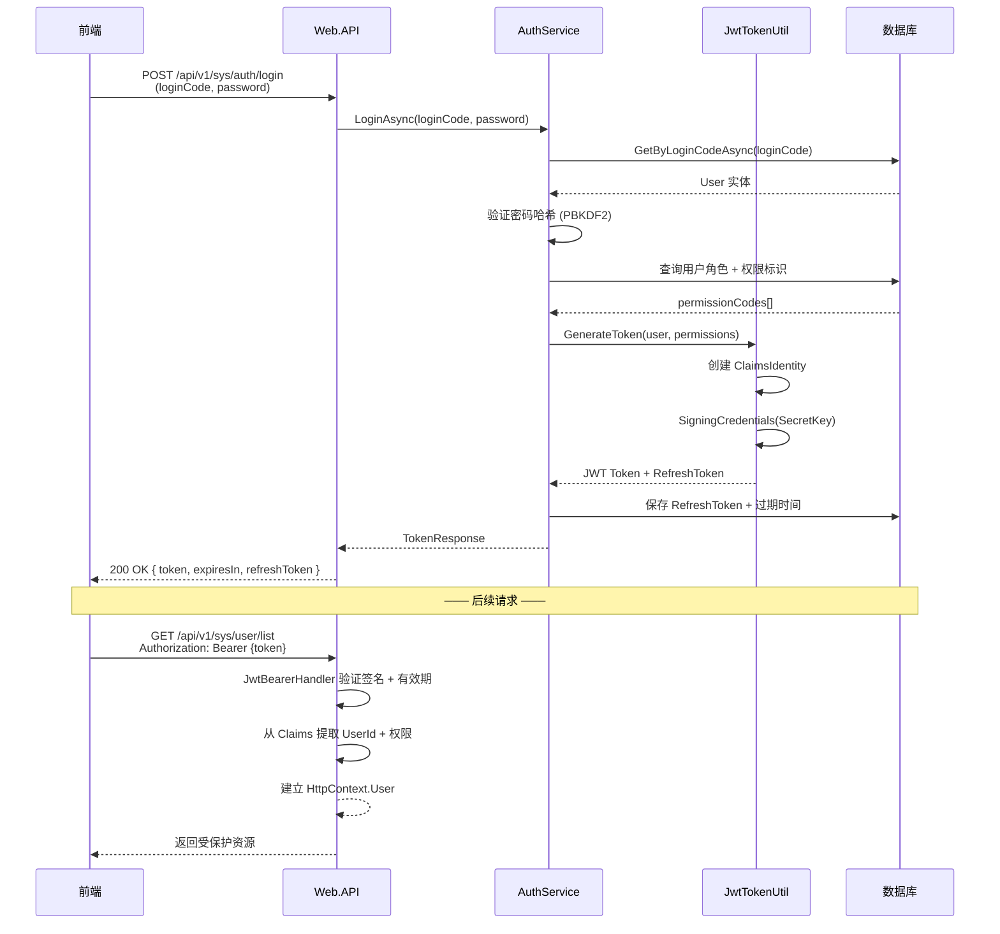
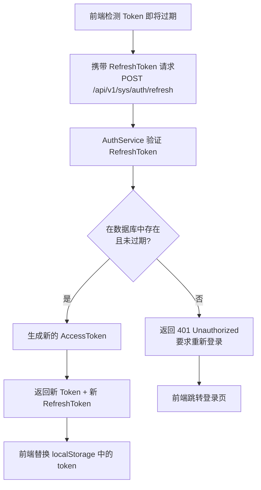

<div align="right">
  <a href="Home">← 返回首页</a>
</div>

---

# 15 JWT认证

> 基于 JWT 的无状态认证体系：Token 生成/刷新/吊销、权限标识、在线用户管理、前端集成。
>
> **适用角色**：全栈开发人员、安全工程师
> **阅读时间**：约 12 分钟
> **相关文档**：[16-OAuth2登录](16-OAuth2登录) · [19-数据与字段权限](19-数据与字段权限)
> 最后更新: 2026-06-13

---

## 📋 目录

  - [一、认证流程总览](#一、认证流程总览)
    - [1.1 完整的 JWT 认证流程](#11-完整的-jwt-认证流程)
    - [1.2 流程设计要点](#12-流程设计要点)
  - [二、关键配置 (appsettings.json)](#二、关键配置-appsettingsjson)
    - [2.1 Jwt 配置节点](#21-jwt-配置节点)
    - [2.2 字段说明](#22-字段说明)
  - [三、服务端实现](#三、服务端实现)
    - [3.1 AuthService（认证主服务）](#31-authservice（认证主服务）)
    - [3.2 ValidCodeService（验证码服务）](#32-validcodeservice（验证码服务）)
    - [3.3 Token 生成核心伪代码](#33-token-生成核心伪代码)
  - [四、权限标识系统](#四、权限标识系统)
    - [4.1 权限标识格式](#41-权限标识格式)
    - [4.2 服务端鉴权](#42-服务端鉴权)
    - [4.3 前端鉴权](#43-前端鉴权)
  - [五、Token 吊销与在线用户](#五、token-吊销与在线用户)
    - [5.1 机制概述](#51-机制概述)
    - [5.2 在线用户管理 API](#52-在线用户管理-api)
    - [5.3 JWT 验证中间件关键步骤](#53-jwt-验证中间件关键步骤)
  - [六、API 端点清单](#六、api-端点清单)
    - [6.1 AuthController](#61-authcontroller)
    - [6.2 AccountController](#62-accountcontroller)
    - [6.3 ValidCodeController](#63-validcodecontroller)
  - [七、前端集成](#七、前端集成)
    - [7.1 用户状态管理（stores/user.ts）](#71-用户状态管理（stores-userts）)
    - [7.2 路由守卫（router/index.ts）](#72-路由守卫（router-indexts）)
    - [7.3 composables/usePermission.ts](#73-composables-usepermissionts)
    - [7.4 directives/permission.ts](#74-directives-permissionts)
    - [7.5 api/auth.ts](#75-api-authts)
  - [八、密码安全](#八、密码安全)
    - [8.1 存储格式](#81-存储格式)
    - [8.2 密码强度校验](#82-密码强度校验)
    - [8.3 密码历史](#83-密码历史)
    - [8.4 密码过期策略](#84-密码过期策略)
    - [8.5 登录失败锁定](#85-登录失败锁定)

---


本文档详细描述 JeeSite.NET 系统中基于 JWT（JSON Web Token）的无状态认证体系，
涵盖认证流程、服务端实现、权限标识、Token 吊销与前端集成等完整链路。

---

### 一、认证流程总览

#### 1.1 完整的 JWT 认证流程

```
客户端 POST /api/v1/sys/auth/login (loginCode + password)
   │
   ▼
服务端 → UserService.GetByCodeAsync(loginCode) → 从数据库获取用户
   │
   ├── 验证密码 (MD5 + salt 比对)
   ├── 检查用户状态 (status=0)
   ├── 检查是否被踢出 (在线用户表或黑名单)
   │
   ▼
生成 JWT Token:
  ├── Header: { alg:HS256, typ:"JWT" }
  ├── Payload:
  │   ├── sub (user_code)
  │   ├── name (user_name)
  │   ├── corp_code
  │   ├── roles (逗号分隔的角色编码)
  │   ├── permissions (权限标识集合，从 role_menu + menu)
  │   ├── iat (issued at)
  │   ├── exp (expiration: 默认 12 小时)
  │   ├── iss (issuer: "JeeSite.NET")
  │   └── jti (JWT ID, 唯一标识，用于吊销)
  └── Signature: HMACSHA256(secret)
   │
   ▼
返回前端: { token:"eyJhbGci...", token_type:"Bearer", expires_in:43200 }
   │
   ▼
前端存储: localStorage.setItem("token") → Pinia store 缓存
   │
   ▼
后续请求: Header → Authorization: Bearer <token>
   │
   ▼
中间件: JwtBearerDefaults.AuthenticationScheme
  ├── 验证签名
  ├── 验证 exp 是否过期
  ├── 验证 iss
  ├── 验证是否在黑名单 (被踢出)
  └── 构造 ClaimsPrincipal → HttpContext.User
```

#### 1.2 流程设计要点

- **无状态设计**：服务端不维护会话状态，所有信息由 JWT 自包含。
- **Claim 齐全但精简**：将核心用户信息（用户编码、用户名、公司、角色、权限）一次性写入
  Payload，避免后续频繁反查数据库。
- **`jti` 作为唯一标识**：用于支持"主动吊销"（如管理员踢出用户）场景。
- **`Bearer` 方案**：所有后续请求需携带 `Authorization: Bearer <token>` 头。

---

### 二、关键配置 (appsettings.json)

#### 2.1 Jwt 配置节点

```json
{
  "Jwt": {
    "Secret": "至少32字节的随机字符串，生产环境必须修改",
    "Issuer": "JeeSite.NET",
    "Audience": "JeeSite.NET-Web",
    "AccessTokenExpirationMinutes": 720,
    "RefreshTokenExpirationDays": 30,
    "ValidateIssuer": true,
    "ValidateAudience": true,
    "ValidateLifetime": true,
    "ClockSkewSeconds": 300
  }
}
```

#### 2.2 字段说明

| 字段 | 类型 | 默认值 | 说明 |
|-----|------|-------|------|
| `Secret` | `string` | — | 签名密钥，HMACSHA256 要求至少 32 字节；生产环境必须替换为随机值。 |
| `Issuer` | `string` | `JeeSite.NET` | Token 签发者，对应 `iss` 声明。 |
| `Audience` | `string` | `JeeSite.NET-Web` | Token 受众，对应 `aud` 声明。 |
| `AccessTokenExpirationMinutes` | `int` | `720` | Access Token 有效期（分钟），默认 12 小时。 |
| `RefreshTokenExpirationDays` | `int` | `30` | Refresh Token 有效期（天）。 |
| `ValidateIssuer` | `bool` | `true` | 是否校验 `iss`。 |
| `ValidateAudience` | `bool` | `true` | 是否校验 `aud`。 |
| `ValidateLifetime` | `bool` | `true` | 是否校验 `exp/nbf`。 |
| `ClockSkewSeconds` | `int` | `300` | 允许的客户端/服务器时钟偏差（秒）。 |

> **安全提示**：`Secret` 务必通过环境变量、密钥管理工具（Azure Key Vault / 阿里云 KMS）或
> `dotnet user-secrets` 注入，**严禁提交到源代码仓库**。

---

### 三、服务端实现

#### 3.1 AuthService（认证主服务）

位于：`JeeSiteNET.Modules.Sys/Application/Services/AuthService.cs`

| 方法 | 签名 | 说明 |
|-----|------|------|
| `LoginAsync` | `(loginCode, password) → LoginResultDto` | 账号密码登录，校验密码+用户状态，生成 JWT。 |
| `LoginByCodeAsync` | `(target, code) → LoginResultDto` | 短信/邮件验证码登录，调用 ValidCodeService。 |
| `LogoutAsync` | `(userCode) → void` | 登出，将当前 token 的 `jti` 加入短期黑名单。 |
| `RefreshTokenAsync` | `(oldToken) → LoginResultDto` | 使用 Refresh Token 换取新的 Access Token。 |
| `GetAuthInfoAsync` | `() → AuthInfoDto` | 获取当前登录用户的完整信息（含角色、公司、机构等）。 |
| `GetMenuRouteAsync` | `(sysCode) → List<MenuRouteDto>` | 获取当前用户可见的菜单树，用于前端动态路由。 |

#### 3.2 ValidCodeService（验证码服务）

| 方法 | 签名 | 说明 |
|-----|------|------|
| `GenerateAndSendAsync` | `(target, scene) → bool` | 为手机号/邮箱生成随机验证码并通过 SMS/Email 发送。 |
| `VerifyAsync` | `(target, scene, code) → bool` | 独立校验验证码（供业务场景使用）。 |

**验证码策略**：

- 场景（`scene`）区分：`login`、`reset-password`、`bind` 等；
- 有效期：默认 5 分钟；
- 频率限制：同一 `target` 每 60 秒最多发送 1 次；
- 错误次数：累计错误 5 次则锁定 15 分钟；
- 存储：Redis（`validcode:{scene}:{target}`），确保分布式部署下一致。

#### 3.3 Token 生成核心伪代码

```csharp
public async Task<LoginResultDto> CreateTokenAsync(User user)
{
    var roles = await _userRoleRepository.GetRoleCodesByUserAsync(user.UserCode);
    var permissions = await _roleMenuRepository.GetPermissionsByRolesAsync(roles);

    var claims = new List<Claim>
    {
        new(JwtRegisteredClaimNames.Sub, user.UserCode),
        new(JwtRegisteredClaimNames.Name, user.UserName),
        new("corp_code", user.CorpCode),
        new("roles", string.Join(",", roles)),
        new("permissions", string.Join(",", permissions)),
        new(JwtRegisteredClaimNames.Iat, DateTimeOffset.UtcNow.ToUnixTimeSeconds().ToString()),
        new(JwtRegisteredClaimNames.Jti, Guid.NewGuid().ToString("N"))
    };

    var key = new SymmetricSecurityKey(Encoding.UTF8.GetBytes(_jwtOptions.Secret));
    var creds = new SigningCredentials(key, SecurityAlgorithms.HmacSha256);

    var token = new JwtSecurityToken(
        issuer: _jwtOptions.Issuer,
        audience: _jwtOptions.Audience,
        claims: claims,
        expires: DateTime.UtcNow.AddMinutes(_jwtOptions.AccessTokenExpirationMinutes),
        signingCredentials: creds);

    return new LoginResultDto
    {
        Token = new JwtSecurityTokenHandler().WriteToken(token),
        TokenType = "Bearer",
        ExpiresIn = _jwtOptions.AccessTokenExpirationMinutes * 60
    };
}
```

---

### 四、权限标识系统

#### 4.1 权限标识格式

```
{模块}:{实体}:{操作}
```

常见示例：

| 标识 | 含义 |
|-----|------|
| `sys:user:add` | 新增用户 |
| `sys:user:edit` | 编辑用户 |
| `sys:user:delete` | 删除用户 |
| `sys:user:view` | 查看用户 |
| `sys:role:assign-menu` | 角色分配菜单权限 |
| `cms:article:publish` | 发布文章 |

- 模块前缀（如 `sys`、`cms`、`codegen`）与模块目录对应，便于归类检索；
- 操作粒度由业务决定，默认包含 `view/add/edit/delete` 四类，特殊场景按需扩展。

#### 4.2 服务端鉴权

```csharp
// 使用 PermissionAttribute 声明权限
[Permission("sys:user:add")]
public async Task<IActionResult> Create([FromBody] UserDto dto) { ... }
```

底层由 `PermissionRequirement + AuthorizationHandler` 实现：

1. 读取 `HttpContext.User` 中 `permissions` claim（逗号分隔字符串）；
2. 检查目标权限字符串是否存在；
3. 若缺失则返回 `403 Forbidden`。

> 对超级管理员（`role_code = "admin"` 或 `is_super_admin = true`），系统默认放行所有权限。

#### 4.3 前端鉴权

```ts
// composables/usePermission.ts
export function usePermission() {
  const { permissions } = storeToRefs(useUserStore());

  function Has(code: string): boolean {
    return permissions.value.includes(code) || isSuperAdmin();
  }

  return { Has, All };
}
```

```vue
<!-- 方式 1：v-permission 指令（无权限时从 DOM 移除） -->
<el-button v-permission="'sys:user:add'" type="primary">新增</el-button>

<!-- 方式 2：模板中调用 usePermission() -->
<el-button v-if="usePermission().Has('sys:user:delete')" type="danger">删除</el-button>
```

---

### 五、Token 吊销与在线用户

#### 5.1 机制概述

由于 JWT 无状态，无法"撤回"已签发的 token。系统引入 **Redis 短期黑名单**：

- 管理员执行"踢出用户"操作时，将对应 token 的 `jti` 写入 Redis；
- Token 验证中间件在每次请求时检查该 `jti` 是否在黑名单中；
- 黑名单 TTL 等于 token 剩余有效期，到期后自动失效，无需人工清理。

#### 5.2 在线用户管理 API

| 方法 | 路径 | 说明 |
|-----|------|------|
| `GET` | `/api/v1/sys/online/list` | 管理员查看当前在线用户（基于 jti 列表）。 |
| `POST` | `/api/v1/sys/online/{userCode}/kick-out` | 强制某用户下线（吊销其所有 jti）。 |

Redis Key 约定：

| Key | 类型 | TTL |
|-----|------|-----|
| `jwt:revoked:{jti}` | `string` | token 剩余有效期 |
| `jwt:online:{userCode}` | `SET<jti>` | 同最长 token 有效期 |

#### 5.3 JWT 验证中间件关键步骤

```
1. 解析 Authorization 头 → 提取 JWT
2. 使用 JwtBearerDefaults 中间件：
   ├── 验证签名（HMACSHA256 + Secret）
   ├── 验证 exp（未过期）
   ├── 验证 iss / aud
   ├── 计算 ClockSkew 容忍
3. 自定义校验（OnTokenValidated 事件）：
   ├── 从 Redis 查询 jwt:revoked:{jti}
   ├── 若存在 → 返回 401 TokenRevoked
   └── 若用户 status != 0 → 返回 401 UserDisabled
4. 构造 ClaimsPrincipal → HttpContext.User
```

---

### 六、API 端点清单

#### 6.1 AuthController

| 方法 | 路径 | 说明 |
|-----|------|------|
| `POST` | `/api/v1/sys/auth/login` | 账号密码登录。 |
| `POST` | `/api/v1/sys/auth/login-by-code` | 手机号/邮箱 + 验证码登录。 |
| `POST` | `/api/v1/sys/auth/logout` | 登出，当前 jti 加入短期黑名单。 |
| `POST` | `/api/v1/sys/auth/refresh` | 使用 Refresh Token 换取新 Access Token。 |
| `GET` | `/api/v1/sys/auth/info` | 获取当前登录用户完整信息。 |
| `GET` | `/api/v1/sys/auth/menu-route` | 获取当前用户可访问菜单树，用于前端动态路由。 |

#### 6.2 AccountController

| 方法 | 路径 | 说明 |
|-----|------|------|
| `POST` | `/api/v1/sys/account/send-valid-code` | 发送短信/邮件验证码。 |
| `POST` | `/api/v1/sys/account/verify-valid-code` | 校验验证码是否正确。 |
| `POST` | `/api/v1/sys/account/login-by-valid-code` | 使用验证码登录（独立于 auth/login）。 |
| `POST` | `/api/v1/sys/account/reset-password-by-code` | 通过验证码重置密码。 |

#### 6.3 ValidCodeController

| 方法 | 路径 | 说明 |
|-----|------|------|
| `GET` | `/api/v1/sys/valid-code/captcha` | 获取图形验证码（SVG 或图片流）。 |

---

### 七、前端集成

#### 7.1 用户状态管理（stores/user.ts）

| 方法 | 说明 |
|-----|------|
| `login({ loginCode, password })` | 调用 `POST /api/v1/sys/auth/login`，成功后将 token 写入 localStorage 与 Pinia。 |
| `logout()` | 调用 `POST /api/v1/sys/auth/logout`，清空本地 token 与用户信息，跳转登录页。 |
| `restoreSession()` | 启动时从 localStorage 读取 token，若有效则调用 `/auth/info` 恢复用户信息。 |
| `refreshToken()` | token 即将过期前自动调用 `/auth/refresh`，实现无感续期。 |

#### 7.2 路由守卫（router/index.ts）

```ts
router.beforeEach((to, from, next) => {
  const { token, hasPermission } = useUserStore();

  if (to.meta.requiresAuth !== false && !token) {
    return next({ path: "/login", query: { redirect: to.fullPath } });
  }
  if (to.meta.permission && !hasPermission(to.meta.permission)) {
    return next({ path: "/403" });
  }
  next();
});
```

#### 7.3 composables/usePermission.ts

- 对外暴露 `Has(permissionString)` / `All([...])` 等方法；
- 内部从 Pinia store 中读取权限集合；
- 对超级管理员做短路放行。

#### 7.4 directives/permission.ts

- 注册全局 `v-permission="'sys:user:add'"` 指令；
- 无权限时从 DOM 中移除元素（而非隐藏），避免信息泄漏；
- 对 `<el-button>`、`<el-table-column>`、`<el-form-item>` 等常用组件均已测试。

#### 7.5 api/auth.ts

封装所有与认证相关的 HTTP 调用：

```ts
export function login(data: LoginDto)   { return request.post<LoginResultDto>("/sys/auth/login", data); }
export function logout()                 { return request.post<void>("/sys/auth/logout"); }
export function refresh()                { return request.post<LoginResultDto>("/sys/auth/refresh"); }
export function getAuthInfo()            { return request.get<AuthInfoDto>("/sys/auth/info"); }
export function getMenuRoute(sysCode?: string) { return request.get<MenuRouteDto[]>("/sys/auth/menu-route"); }
```

---

### 八、密码安全

#### 8.1 存储格式

```
password = MD5(MD5(明文密码) + salt)
salt = 每用户独立随机 16 字节（Base64 存储）
```

字段设计（sys_user 表）：

| 列 | 类型 | 说明 |
|----|------|------|
| `password` | `varchar(64)` | 最终 MD5 结果（32 字节 hex） |
| `salt` | `varchar(32)` | 每用户独立 salt（Base64 编码约 24 字符） |

> 推荐：新部署可在 `appsettings.json` 中开启 `UseStrongHash = true`，
> 使用 PBKDF2 / Argon2id 算法替代 MD5，以获得更强抗暴力破解能力。

#### 8.2 密码强度校验

新密码需同时满足以下条件（`PasswordValidator` 中实现）：

- 长度 ≥ 8；
- 至少包含 1 个大写字母；
- 至少包含 1 个小写字母；
- 至少包含 1 个数字；
- 至少包含 1 个特殊字符（`!@#$%^&*()_+-=` 等）；
- 不得包含用户账号、姓名、手机号、邮箱等易猜测片段。

#### 8.3 密码历史

- 用户修改密码时，系统保存最近 N 次密码的哈希（默认 N = 5，可在 `sys_config` 中配置）；
- 若新密码与历史记录重复，拒绝修改；
- 历史记录仅保存哈希值，不保存明文。

#### 8.4 密码过期策略

| 策略 | 默认值 | 说明 |
|-----|-------|------|
| 有效期 | 90 天 | 从 `last_password_update_date` 起算。 |
| 提前提醒 | 7 天 | 到期前登录时弹出"请修改密码"提示。 |
| 强制修改 | 是 | 到期后登录强制跳转修改页，未修改不可使用其他功能。 |

> 以上阈值均可在 `sys_config`（`sys:password:policy`）中按租户/公司级别覆盖。

#### 8.5 登录失败锁定

- 同一账号连续失败 5 次 → 锁定 30 分钟；
- 失败计数保存在 Redis（`login:fail:{loginCode}`）；
- 登录成功时自动清零失败计数。

---

**第一部分小结**：JeeSite.NET 的 JWT 认证体系采用"**自包含 Claim + Redis 黑名单 + Claim-Base 权限**"三层
结构，兼顾了无状态可扩展性与管理员主动干预的能力。在实施中，务必关注 `Secret` 管理、TLS 传输、
密码强度与登录锁定四项基础安全措施。

---


---

## 🏗️ 架构与数据流

### 认证时序图



### Token 刷新流程图



---

## 💡 快速参考

### 核心类与接口表

| 类型 | 名称 | 命名空间 | 说明 |
|------|------|---------|------|
| Service | `AuthService` | `JeeSiteNET.Modules.Sys.Application.Services` | 认证主服务（登录/刷新/吊销/获取用户信息） |
| Service | `ValidCodeService` | `JeeSiteNET.Modules.Sys.Application.Services` | 验证码（短信/邮件）发送与校验服务 |
| Service | `PermissionRequirementHandler` | `JeeSiteNET.Modules.Sys.Application.Authorization` | 权限标识授权处理器 |
| Controller | `AuthController` | `JeeSiteNET.Modules.Sys.Controllers` | 认证 API（登录/刷新/注销/信息/菜单） |
| Controller | `ValidCodeController` | `JeeSiteNET.Modules.Sys.Controllers` | 图形验证码 API |
| Middleware | `JwtBearerMiddleware` | `Microsoft.AspNetCore.Authentication.JwtBearer` | JWT 认证中间件（配合自定义 `OnTokenValidated`） |
| Entity | `User` | `JeeSiteNET.Modules.Sys.Domain.Entities` | 用户主体（含 status/last_login_ip 等） |
| Interface | `IDataScoped` | `JeeSiteNET.Core.Domain` | 数据权限标记接口（详见文档 19） |

### 常用 API 速查表

| 方法 | API | 说明 | 对应服务方法 |
|------|-----|------|-------------|
| `POST` | `/api/v1/sys/auth/login` | 账号密码登录，返回 JWT | `AuthService.LoginAsync(loginCode, password)` |
| `POST` | `/api/v1/sys/auth/login-by-code` | 手机号/邮箱 + 验证码登录 | `AuthService.LoginByCodeAsync(target, code)` |
| `POST` | `/api/v1/sys/auth/logout` | 注销当前 jti（加入 Redis 黑名单） | `AuthService.LogoutAsync(userCode)` |
| `POST` | `/api/v1/sys/auth/refresh` | 使用 Refresh Token 换取新 Access Token | `AuthService.RefreshTokenAsync(oldToken)` |
| `GET` | `/api/v1/sys/auth/info` | 获取当前登录用户完整信息（角色/公司/权限） | `AuthService.GetAuthInfoAsync()` |
| `GET` | `/api/v1/sys/auth/menu-route` | 获取当前用户可见菜单树（动态路由） | `AuthService.GetMenuRouteAsync(sysCode)` |
| `GET` | `/api/v1/sys/online/list` | 管理员查看当前在线用户（jti 列表） | — |
| `POST` | `/api/v1/sys/online/{userCode}/kick-out` | 强制某用户下线（吊销所有 jti） | — |
| `GET` | `/api/v1/sys/valid-code/captcha` | 获取图形验证码（SVG/图片流） | `ValidCodeController` |

### 最小工作示例（C# 代码块）

```csharp
// ===== 1. 登录并获取 Token =====
var user = await _userRepository.GetByCodeAsync(loginCode);
if (user == null || user.Status != 0)
    throw new UnauthorizedAccessException("账号不存在或已禁用");

if (!VerifyPassword(password, user.Password, user.Salt))
    throw new UnauthorizedAccessException("账号或密码错误");

var token = await _authService.CreateTokenAsync(user);
return new { token.Token, token.ExpiresIn, user.UserName };

// ===== 2. 生成 JWT（核心伪代码）=====
var claims = new List<Claim>
{
    new(JwtRegisteredClaimNames.Sub, user.UserCode),
    new(JwtRegisteredClaimNames.Name, user.UserName),
    new("corp_code", user.CorpCode),
    new("roles", string.Join(",", roles)),
    new("permissions", string.Join(",", permissions)),
    new(JwtRegisteredClaimNames.Jti, Guid.NewGuid().ToString("N"))
};

var key = new SymmetricSecurityKey(Encoding.UTF8.GetBytes(_jwtOptions.Secret));
var creds = new SigningCredentials(key, SecurityAlgorithms.HmacSha256);
var jwt = new JwtSecurityToken(
    issuer: _jwtOptions.Issuer,
    audience: _jwtOptions.Audience,
    claims: claims,
    expires: DateTime.UtcNow.AddMinutes(_jwtOptions.AccessTokenExpirationMinutes),
    signingCredentials: creds);

string tokenValue = new JwtSecurityTokenHandler().WriteToken(jwt);

// ===== 3. 自定义权限标识授权 =====
// 声明
[Permission("sys:user:add")]
public async Task<IActionResult> Create([FromBody] UserDto dto) { ... }

// 自定义 OnTokenValidated 事件（检查 jti 黑名单 + 用户状态）
options.Events = new JwtBearerEvents
{
    OnTokenValidated = async context =>
    {
        var jti = context.Principal?.FindFirstValue(JwtRegisteredClaimNames.Jti);
        var userCode = context.Principal?.FindFirstValue(JwtRegisteredClaimNames.Sub);
        if (await _redis.StringGetAsync($"jwt:revoked:{jti}").HasValue)
        {
            context.Fail("Token revoked");
            return;
        }
        var user = await _userRepository.GetByCodeAsync(userCode);
        if (user == null || user.Status != 0) context.Fail("User disabled");
    }
};

// ===== 4. 前端调用（Vue 3 + Pinia）=====
// stores/user.ts
export const useUserStore = defineStore("user", () => {
    const token = ref(localStorage.getItem("token") || "");
    async function login({ loginCode, password }) {
        const { data } = await request.post("/sys/auth/login", { loginCode, password });
        token.value = data.token;
        localStorage.setItem("token", data.token);
    }
    async function restoreSession() {
        if (!token.value) return;
        const { data } = await request.get("/sys/auth/info");
        // data.roles / data.permissions 渲染菜单与按钮
    }
    return { token, login, logout, restoreSession };
});
```

### 配置项清单表

| 配置键 | 默认值 | 数据类型 | 说明 | 必填 |
|--------|--------|---------|------|------|
| `Auth:Jwt:Secret` | (空) | string | JWT 签名密钥，≥ 256 位，生产环境必须通过环境变量注入 | ✅ |
| `Auth:Jwt:Issuer` | `JeeSite.NET` | string | Token 签发者（iss claim） | ⬜ |
| `Auth:Jwt:Audience` | `JeeSite.NET-Web` | string | Token 受众（aud claim） | ⬜ |
| `Auth:Jwt:AccessTokenExpirationMinutes` | `720` | int | Access Token 有效期（分钟），默认 12 小时 | ⬜ |
| `Auth:Jwt:RefreshTokenExpirationDays` | `30` | int | Refresh Token 有效期（天） | ⬜ |
| `Auth:Jwt:ClockSkewSeconds` | `300` | int | 允许的客户端/服务器时钟偏差（秒） | ⬜ |
| `Auth:Jwt:ValidateIssuer` | `true` | bool | 是否校验 iss | ⬜ |
| `Auth:Jwt:ValidateAudience` | `true` | bool | 是否校验 aud | ⬜ |
| `Auth:Password:MinLength` | `8` | int | 最小密码长度 | ⬜ |
| `Auth:Password:UseStrongHash` | `false` | bool | 是否启用 PBKDF2/Argon2id 替代 MD5 | ⬜ |
| `Auth:Login:MaxFailCount` | `5` | int | 连续失败锁定阈值 | ⬜ |
| `Auth:Login:LockMinutes` | `30` | int | 失败锁定持续时间（分钟） | ⬜ |
| `Redis:ConnectionString` | (空) | string | Redis 连接（用于 jti 黑名单 + 验证码 + 失败计数） | ✅ |

---

## ❓ 常见问题（3-5 个）

**Q1. JWT Token 被窃取后能否主动吊销？**
可以。JeeSite.NET 通过 `jwt:revoked:{jti}` Redis 黑名单实现主动吊销。管理员在「在线用户 → 踢出」或用户执行 logout 时，对应 jti 会被写入 Redis（TTL = token 剩余有效期）。中间件在每次请求时检查该 key，命中则返回 401。

**Q2. Token 过期后如何无感刷新？**
前端检测到 API 返回 401 时（或距离 exp 剩余 <5 分钟），自动调用 `POST /api/v1/sys/auth/refresh`，服务端验证 Refresh Token（独立于 Access Token，更长 TTL）后下发新 Access Token。若 Refresh Token 也过期，则强制重新登录。

**Q3. 为何 Payload 中把 roles/permissions 全部写入？**
为避免每次请求反查数据库。JeeSite.NET 的权限标识（如 `sys:user:add`）数量有限，序列化后 Token 体积通常在 2KB 以内，可被大多数反向代理与浏览器 Accept。若权限频繁变更（分钟级），可改为仅写入 userCode，在服务端通过 `PermissionRequirementHandler` 实时查询。

**Q4. Secret 如何安全管理？**
严禁提交到源码仓库。推荐方案：① 开发环境使用 `dotnet user-secrets`；② 生产环境通过环境变量或云密钥管理服务（Azure Key Vault / 阿里云 KMS / HashiCorp Vault）注入；③ 每 90 天轮换一次 Secret，轮换期内同时接受新旧两个密钥。

**Q5. 多角色用户的权限如何合并？**
JWT Payload 中 `roles` 为逗号分隔的多角色代码；`permissions` 为所有角色权限标识的并集。若多个角色对同一菜单配置了不同数据权限，取最高权限（最宽松）。字段权限同样取并集——任一角色隐藏即隐藏。

---

## 📚 相关文档（上一篇/同系列/下一篇 + 跨系列）

| 类别 | 文档 | 说明 |
|------|------|------|
| 上一篇 | [14-Excel 导入导出](14-Excel导入导出) | 表格数据导入导出安全（与字段权限/数据权限联动） |
| 同系列 | [16-OAuth2 登录](16-OAuth2登录) | 第三方 OAuth 2.0 / OpenID Connect 登录方案 |
| 同系列 | [17-CAS 单点登录](17-CAS单点登录) | 企业级 CAS SSO 身份认证 |
| 同系列 | [18-LDAP 认证](18-LDAP认证) | AD / OpenLDAP 目录服务认证 |
| 同系列 | [19-数据与字段权限](19-数据与字段权限) | 行级/列级权限的实现细节 |
| 下一篇 | [20-AI 智能问答](20-AI智能问答) | AI 能力集成（认证同样适用本 Token 体系） |
| 跨系列 | [33-深入架构剖析](33-深入架构剖析) | 权限/认证在整体架构中的定位 |
| 跨系列 | [03-Sys 系统管理](03-Sys系统管理) | 用户/角色/菜单后台管理模块 |

---

## 🚀 下一步（推荐阅读）

1. 先阅读 **[19-数据与字段权限](19-数据与字段权限)**，理解 JWT 中 `roles`/`permissions` 如何在 Service 层被消费。
2. 若系统面向企业用户，按 **[17-CAS](17-CAS单点登录)** 或 **[18-LDAP](18-LDAP认证)** 接入统一身份源，减少本地账号管理。
3. 检查 `appsettings.json` 中 `Auth:Jwt:Secret` 是否通过环境变量注入；**生产环境必须修改默认值**。
4. 在前端 `router/index.ts` 中实现路由守卫 + `composables/usePermission.ts`，统一控制菜单与按钮可见性。
5. 启用 `LdapSyncJob` 或 CAS 自动创建用户后，需评审「普通员工」默认角色权限，避免越权访问。

---

<div align="center">
  <small>本文档最后更新: 2026-06-13 · JeeSite.NET Wiki</small>
</div>