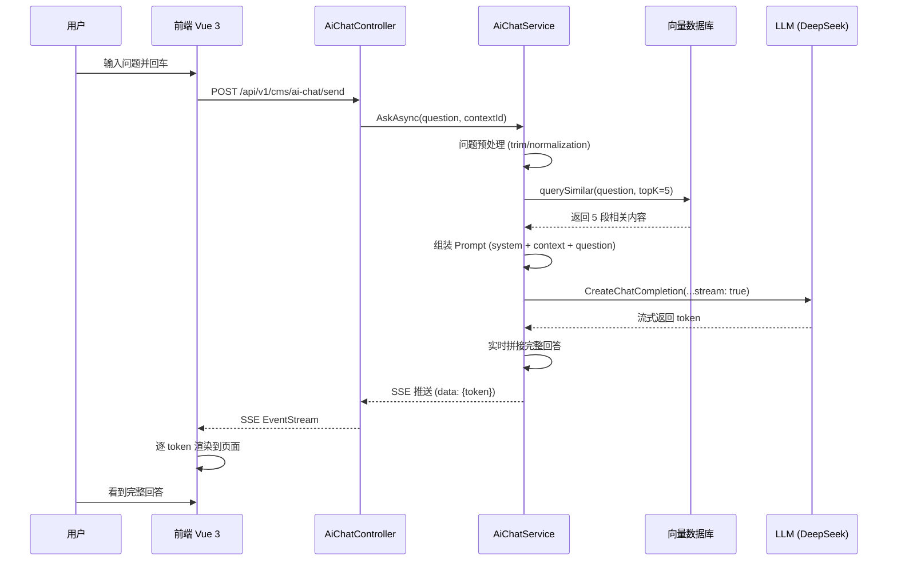

<div align="right">
  <a href="Home">← 返回首页</a>
</div>

---

# 20 AI智能问答

> 基于向量相似度检索 + LLM 生成的 AI 智能问答系统，支持 RAG、流式输出、工具调用。
>
> **适用角色**：架构师、AI 应用开发者
> **阅读时间**：约 12 分钟
> **相关文档**：[21-MCP服务协议](21-MCP服务协议) · [26-AI-Tools开发](26-AI-Tools开发)
> 最后更新: 2026-06-13

---

## 📋 目录

- [一、系统架构](#一、系统架构)
- [二、核心服务](#二、核心服务)
  - [AiChatService — AI 对话主服务](#aichatservice-—-ai-对话主服务)
  - [ArticleVectorStore — 向量存储服务](#articlevectorstore-—-向量存储服务)
  - [ArticleIndexService — 文章索引调度服务](#articleindexservice-—-文章索引调度服务)
- [三、向量存储](#三、向量存储)
  - [默认实现：PostgreSQL pgvector](#默认实现：postgresql-pgvector)
  - [可选方案](#可选方案)
  - [向量维度](#向量维度)
  - [相似度算法](#相似度算法)
- [四、LLM 接入](#四、llm-接入)
  - [支持的 Provider](#支持的-provider)
  - [配置（appsettings.json）](#配置（appsettingsjson）)
- [五、AI Tools 框架](#五、ai-tools-框架)
  - [统一工具接口：IAiTool + AiToolAttribute](#统一工具接口：iaitool-aitoolattribute)
  - [内置工具](#内置工具)
  - [自定义工具扩展步骤](#自定义工具扩展步骤)
- [六、控制器与 API](#六、控制器与-api)
  - [AiChatController](#aichatcontroller)
  - [前端页面](#前端页面)
- [七、会话管理与缓存](#七、会话管理与缓存)
  - [会话隔离](#会话隔离)
  - [消息历史存储](#消息历史存储)
  - [会话生命周期](#会话生命周期)
- [八、成本与限流](#八、成本与限流)
  - [Token 消耗日志](#token-消耗日志)
  - [用户级别限流](#用户级别限流)
  - [全局限流](#全局限流)
- [九、AI 写作助手](#九、ai-写作助手)
  - [支持的写作类型](#支持的写作类型)
  - [交互流程](#交互流程)
  - [相关配置](#相关配置)

---


> 基于 LLM (DeepSeek / OpenAI / Azure OpenAI) + 向量库 + RAG（检索增强生成）的智能问答系统。

---

## 一、系统架构

智能问答系统采用经典的 RAG 架构，将用户提问通过向量相似度检索定位到相关知识库文章，再交由 LLM 基于检索到的上下文生成答案。

```
┌──────────────┐      ┌──────────────┐     ┌─────────────┐
│ 用户提问       │────▶│ 向量相似度检索 │────▶│ LLM         │
│ "如何重置密码?" │      │ (Top-K=3)      │     │ 基于 3 篇文章 │
└──────────────┘      │ 1. 用户管理... │     │ 生成答案    │
                       │ 2. 账号安全... │     └──────┬──────┘
                       │ 3. 登录问题... │            ▼
                       └──────┬─────────┘     返回用户
                              ▼
                       构建 Prompt:
                       "上下文: {articles}
                        用户问题: {question}
                        请根据上文回答用户问题..."
```

**架构要点**:

1. **提问 → 向量检索**：用户提问先经 Embedding 模型转换为向量，在向量库中做余弦相似度 Top-K 检索（默认 K=3）。
2. **Prompt 拼接**：检索到的文章标题+摘要+正文片段作为上下文，与用户问题拼接为结构化 Prompt。
3. **LLM 回答**：LLM 仅基于提供的上下文回答问题。若上下文无相关内容，则回复"知识库中暂无相关信息"。
4. **流式输出**：前端使用 SSE（Server-Sent Events）或 Fetch Streaming 逐 token 渲染，用户体验更佳。

---

## 二、核心服务

### AiChatService — AI 对话主服务

位置：`modules/JeeSiteNET.Modules.Cms/Services/AiChatService.cs`

| 方法 | 签名 | 说明 |
|------|------|------|
| ChatAsync | `Task<string> ChatAsync(string userQuestion, string sessionId)` | 单轮对话，不保留历史 |
| ChatWithHistoryAsync | `Task<string> ChatWithHistoryAsync(string userQuestion, string sessionId)` | 多轮对话，自动维护会话上下文 |
| ClearSessionAsync | `Task ClearSessionAsync(string sessionId)` | 清除指定会话的历史上下文 |
| GetAvailableToolsAsync | `Task<List<AiToolInfo>> GetAvailableToolsAsync()` | 获取可用的 AI Tool 列表 |
| ChatWithToolsAsync | `Task<string> ChatWithToolsAsync(string userQuestion, string sessionId, List<string> toolIds)` | 支持 Tool Calling 的对话 |

### ArticleVectorStore — 向量存储服务

位置：`modules/JeeSiteNET.Modules.Cms/Services/ArticleVectorStore.cs`

| 方法 | 签名 | 说明 |
|------|------|------|
| StoreAsync | `Task StoreAsync(string articleId, string title, string content, string category)` | 文章向量化并存储 |
| SearchAsync | `Task<List<VectorSearchResult>> SearchAsync(string query, int topK, string categoryFilter)` | 相似度检索，返回 Top-K 结果 |
| DeleteAsync | `Task DeleteAsync(string articleId)` | 文章删除时同步清理向量 |
| RebuildAllAsync | `Task RebuildAllAsync()` | 全量重建向量库（扫描所有已发布文章） |

### ArticleIndexService — 文章索引调度服务

位置：`modules/JeeSiteNET.Modules.Cms/Services/ArticleIndexService.cs`

| 方法 | 签名 | 说明 |
|------|------|------|
| IndexArticleAsync | `Task IndexArticleAsync(Article article)` | 单篇文章索引（向量库 + ES + 全文） |
| IndexAllAsync | `Task IndexAllAsync()` | 全量索引（后台任务，进度写入日志） |

**索引策略**:

- **按栏目分片**：不同栏目（category）可配置不同的索引策略（是否索引、向量模型等）。
- **按发布时间分区**：超过 1 年的文章可按需延迟索引或仅索引标题，节省 Token。

---

## 三、向量存储

### 默认实现：PostgreSQL pgvector

系统默认使用 PostgreSQL 的 `pgvector` 扩展作为向量存储，优点是无需额外维护独立服务。

| 项目 | 值 |
|------|-----|
| 扩展 | `pgvector` |
| 列类型 | `vector(1536)` 或 `vector(768)` |
| 索引类型 | `HNSW` (hnsw) 或 `IVFFlat` |
| 相似度函数 | `1 - (embedding <=> query_embedding)` (余弦) |

建表示例（由 EF Core Migration 自动生成）：

```sql
CREATE TABLE cms_article_vector (
    article_id VARCHAR(32) PRIMARY KEY,
    category_code VARCHAR(128),
    embedding vector(1536),
    create_date TIMESTAMP DEFAULT CURRENT_TIMESTAMP
);
CREATE INDEX ON cms_article_vector USING hnsw (embedding vector_cosine_ops);
```

### 可选方案

系统提供 `IVectorStore` 抽象接口，可切换以下实现：

| 引擎 | 场景 | 说明 |
|------|------|------|
| **Qdrant** | 高性能纯向量库 | Rust 实现，支持过滤条件和分片 |
| **Milvus** | 大规模向量搜索 | Linux Foundation 项目，企业级功能齐全 |
| **Pinecone** | 托管服务 | SaaS，无需运维 |

### 向量维度

| Embedding 模型 | 维度 | 备注 |
|----------------|------|------|
| `text-embedding-3-small` (OpenAI) | 1536 | 默认，英语表现佳 |
| `bge-small-zh-v1.5` (BAAI) | 768 | 中文表现佳，可本地推理 |
| `text-embedding-3-large` (OpenAI) | 3072 | 最高质量，成本更高 |

### 相似度算法

- **余弦相似度 (Cosine Similarity)**：默认，对文本语义匹配效果最好。
- 其他（可选）：点积、欧氏距离。

---

## 四、LLM 接入

### 支持的 Provider

| Provider | BaseUrl | 典型模型 |
|----------|---------|---------|
| **DeepSeek** | `https://api.deepseek.com/v1` | `deepseek-chat` / `deepseek-reasoner` |
| **OpenAI** | `https://api.openai.com/v1` | `gpt-4o-mini` / `gpt-4o` |
| **Azure OpenAI** | `https://{your-resource}.openai.azure.com/` | 模型需在 Azure 门户部署 |
| **本地 Ollama** | `http://localhost:11434/v1` | `llama3` / `qwen2` / `qwen2.5` |

### 配置（appsettings.json）

```json
{
  "Ai": {
    "Provider": "DeepSeek",
    "ApiKey": "sk-your-api-key",
    "BaseUrl": "https://api.deepseek.com/v1",
    "ChatModel": "deepseek-chat",
    "EmbeddingModel": "text-embedding-3-small",
    "Temperature": 0.3,
    "MaxTokens": 2048,
    "SystemPrompt": "你是 JeeSite.NET 的智能助手，请基于知识库内容回答用户问题。"
  }
}
```

**配置说明**:

| 字段 | 说明 |
|------|------|
| `Provider` | 可选 `DeepSeek` / `OpenAI` / `AzureOpenAI` / `Ollama` |
| `Temperature` | 0.0~2.0，越低越确定，越高越有创造性。问答建议 0.3 |
| `MaxTokens` | 单次回答最大 Token 数 |
| `SystemPrompt` | 系统级指令，可定义助手的角色与行为 |

---

## 五、AI Tools 框架

### 统一工具接口：`IAiTool` + `AiToolAttribute`

所有可被 LLM 调用的工具实现统一接口，通过 `AiToolAttribute` 描述工具元信息（名称、描述、输入 JSON Schema）。

接口定义：

```csharp
public interface IAiTool
{
    Task<string> ExecuteAsync(Dictionary<string, object> parameters);
}

[AttributeUsage(AttributeTargets.Class)]
public class AiToolAttribute : Attribute
{
    public string Name { get; }
    public string Description { get; }
    public string InputSchema { get; set; }  // JSON Schema
}
```

### 内置工具

| Tool Name | 描述 | 对应模块 |
|-----------|------|---------|
| `cms.search_article` | 搜索 CMS 文章内容 | Cms |
| `cms.get_article` | 获取文章详情 | Cms |
| `sys.date_time` | 获取当前日期时间 | Sys |
| `sys.weather` | 查询指定城市的天气 | Sys |

### 自定义工具扩展步骤

1. **实现接口并添加注解**

   ```csharp
   [AiTool("my_tool", "我的自定义工具，用于演示",
       InputSchema = "{\"type\":\"object\",\"properties\":{\"query\":{\"type\":\"string\"}},\"required\":[\"query\"]}")]
   public class MyTool : IAiTool
   {
       public async Task<string> ExecuteAsync(Dictionary<string, object> parameters)
       {
           var query = parameters.GetValueOrDefault("query")?.ToString();
           // 业务逻辑...
           return JsonSerializer.Serialize(new { success = true, data = query });
       }
   }
   ```

2. **注册到 DI**

   在 `Startup.cs` / `Program.cs` 中：`services.AddScoped<IAiTool, MyTool>();`

3. **自动被 LLM 调用**

   调用 `AiChatService.ChatWithToolsAsync(question, sessionId, toolIds)` 时，LLM 根据用户意图决定是否调用工具，框架自动执行并返回结果给 LLM 作为补充上下文。

---

## 六、控制器与 API

### AiChatController

位置：`modules/JeeSiteNET.Modules.Cms/Controllers/AiChatController.cs`

| HTTP | 路由 | 说明 |
|------|------|------|
| POST | `/api/v1/cms/ai-chat/send` | 发送问题 → 返回流式 / 非流式回答 |
| GET | `/api/v1/cms/ai-chat/tools` | 可用工具列表 |
| POST | `/api/v1/cms/ai-chat/clear` | 清除当前会话 |
| GET | `/api/v1/cms/ai-chat/history` | 获取当前会话历史 |

**请求示例（POST /api/v1/cms/ai-chat/send）**:

```json
{
  "question": "如何重置密码？",
  "sessionId": "sess_abc123",
  "useRag": true,
  "useTools": true,
  "stream": true
}
```

**响应（stream=true）**：逐 chunk 返回 SSE 格式：

```
data: {"content": "您可以", "done": false}
data: {"content": "通过登录", "done": false}
data: {"content": "页面的 '忘记密码' 链接重置...", "done": true}
```

### 前端页面

| 位置 | 说明 |
|------|------|
| `frontend/src/views/cms/AiChat.vue` | 智能问答聊天界面 |
| `frontend/src/views/cms/ArticleEdit.vue` | 文章编辑页（集成"AI 帮写"按钮） |
| `frontend/src/views/Shared/Components/VditorEditor.vue` | Vditor 编辑器封装，已支持 AI 插件 |

---

## 七、会话管理与缓存

### 会话隔离

- 每个用户的每个会话独立维护上下文。
- Key 格式：`ai:chat:history:{userCode}:{sessionId}`

### 消息历史存储

- **存储介质**：Redis
- **数据结构**：List\<ChatMessage\>（含 role=system/user/assistant + content）
- **历史长度**：默认保留最近 **20 条**消息（可在 `appsettings.json` 中通过 `Ai:HistoryLimit` 调整）
- **TTL**：**24 小时**

### 会话生命周期

```
用户打开对话框 → 自动创建 sessionId (UUID)
       ↓
发送消息 → ChatWithHistoryAsync 读取历史 → LLM 调用 → 追加 LLM 回复到历史
       ↓
24 小时未操作 / 手动清除 → Redis Key 过期 → 上下文丢失
```

---

## 八、成本与限流

### Token 消耗日志

每次 LLM 调用都会在 `sys_ai_usage` 表中记录以下字段：

| 字段 | 说明 |
|------|------|
| `user_code` | 调用用户 |
| `session_id` | 会话 ID |
| `provider` | 使用的 Provider |
| `model` | 使用的模型 |
| `prompt_tokens` | Prompt Token 数 |
| `completion_tokens` | 回答 Token 数 |
| `total_tokens` | 合计 |
| `cost_usd` | 费用估算（按模型单价） |
| `call_date` | 调用时间 |

### 用户级别限流

| 维度 | 默认值 | 配置项 |
|------|--------|--------|
| 每用户每小时调用次数 | **30 次** | `Ai:RateLimit:PerUserPerHour` |
| 每用户每分钟调用次数 | **5 次** | `Ai:RateLimit:PerUserPerMinute` |

### 全局限流

| 维度 | 默认值 | 配置项 |
|------|--------|--------|
| 系统每日总调用次数 | **10,000 次** | `Ai:RateLimit:PerDay` |
| 系统每分钟总调用次数 | **200 次** | `Ai:RateLimit:PerMinute` |

> 限流基于 AspNetCoreRateLimit 中间件实现，可在管理界面手动调整策略而无需重启。

---

## 九、AI 写作助手

文章编辑页 `ArticleEdit.vue` 的 **"AI 帮写"** 按钮可调用专用 prompt 辅助内容创作。

### 支持的写作类型

| 类型 | 说明 | Prompt 要点 |
|------|------|------------|
| **摘要生成** | 根据正文自动生成 100~200 字摘要 | "请为以下文章写一个简洁摘要..." |
| **扩写** | 将选定段落扩展为更详细内容 | "请将以下文字扩写为详细段落..." |
| **润色** | 优化语句使其更流畅专业 | "请润色以下文字，保持原意..." |
| **翻译** | 中英互译（或其他语言） | "Please translate the following into English..." |
| **续写** | 在光标位置后继续撰写 | "请续写以下内容，风格保持一致..." |

### 交互流程

1. 用户在 Vditor 编辑器中选中文字（或光标定位）
2. 点击 **"AI 帮写"** → 弹出类型选择菜单
3. 选择类型 → 发送至后端 `POST /api/v1/cms/ai-chat/write-assist`
4. 后端调用 LLM → 返回结果 → 自动插入编辑器光标位置

### 相关配置

```json
{
  "Ai": {
    "WriteAssistModel": "deepseek-chat",
    "WriteAssistTemperature": 0.7,
    "WriteAssistMaxTokens": 1500
  }
}
```

---

*文档最后更新：2026-06-12*
---

<div align="center">
  <small>本文档最后更新: 2026-06-12 · JeeSite.NET Wiki</small>
</div>

---

## 🏗️ 架构与数据流

### RAG 问答流程图

```mermaid
flowchart TD
    A[用户输入问题<br/>"如何配置 JWT？"] --> B[问题预处理<br/>中文分词 / 去停用词]
    B --> C[向量相似度检索 Top-K<br/>(向量数据库)]

    C --> D1[文章向量 1<br/>score: 0.92]
    C --> D2[文章向量 2<br/>score: 0.85]
    C --> D3[文章向量 3<br/>score: 0.78]

    D1 --> E[组装 Prompt<br/>上下文 = 文章1+2+3]
    D2 --> E
    D3 --> E

    E --> F["基于以下上下文回答问题：<br/>{context}<br/>问题：{question}"]
    F --> G[调用 LLM API<br/>(DeepSeek / OpenAI)]
    G --> H[流式输出 SSE<br/>逐 token 返回给前端]
    H --> I[前端实时渲染答案]

    J[内容编辑/发布<br/>新增文章] --> K[文章向量化<br/>Embedding API]
    K --> L[写入向量索引<br/>FAISS / pgvector]
```

### RAG 详细时序图



---

## 💡 快速参考

### 核心类与接口

| 类型 | 名称 | 命名空间 | 说明 |
|------|------|---------|------|
| Service | `AiChatService` | `JeeSiteNET.Modules.Cms.Application.Services` | AI 对话主服务（含多轮对话历史、Tool Calling） |
| Service | `ArticleVectorStore` | `JeeSiteNET.Modules.Cms.Application.Services` | 向量存储与相似度检索（默认 pgvector 实现） |
| Service | `ArticleIndexService` | `JeeSiteNET.Modules.Cms.Application.Services` | 文章索引调度服务（向量库 + ES 双写） |
| Controller | `AiChatController` | `JeeSiteNET.Modules.Cms.Controllers` | AI 对话 HTTP API（含流式 SSE 返回） |
| Interface | `IAiTool` | `JeeSiteNET.Core.Interfaces` | AI 工具统一接口（被 LLM 调用的工具需实现） |
| Attribute | `AiToolAttribute` | `JeeSiteNET.Core.Annotations` | AI 工具元信息标记（Name/Description/InputSchema） |
| Registry | `AiToolRegistry` | `JeeSiteNET.Modules.Cms.Application.Services` | 工具注册与发现中心（反射扫描所有 `[AiTool]`） |

### 常用 API 速查

| API | 方法 | 说明 |
|-----|------|------|
| `POST /api/v1/cms/ai-chat/send` | `AiChatService.ChatAsync()` | 问答请求（`stream=true` 时返回 SSE 流式） |
| `POST /api/v1/cms/ai-chat/clear` | `AiChatService.ClearSessionAsync()` | 清除指定会话上下文 |
| `GET /api/v1/cms/ai-chat/history` | — | 获取当前会话消息历史（Redis） |
| `POST /api/v1/cms/ai-chat/write-assist` | — | AI 写作助手（摘要/扩写/润色/翻译/续写） |
| `ArticleVectorStore.SearchAsync(query, topK, category)` | — | 向量相似度 Top-K 检索 |
| `ArticleVectorStore.StoreAsync(articleId, title, content, category)` | — | 文章向量化并存入向量库 |
| `ArticleIndexService.IndexArticleAsync(article)` | — | 单篇文章双写索引（向量库 + ES） |
| `ArticleIndexService.IndexAllAsync()` | — | 全量重建索引（后台任务，进度写入日志） |

### 最小工作示例

```csharp
// ===== 1. 在 Controller 中发起 AI 对话 =====
[HttpPost("send")]
public async Task<IActionResult> Send([FromBody] ChatRequest request)
{
    var response = await _aiChatService.ChatAsync(
        userMessage: request.Message,
        sessionId: request.SessionId ?? Guid.NewGuid().ToString("N"),
        userCode: CurrentUser.UserCode,
        enabledToolNames: request.UseTools ? null : new List<string>(), // null=使用全部已注册工具
        ct: HttpContext.RequestAborted
    );
    return Ok(new { response.Answer, response.TokenUsage, response.ToolCalls });
}

// ===== 2. 向量库检索增强（RAG）=====
// RAG = 检索（Retrieve）+ 增强（Augmented）+ 生成（Generate）
// 用户提问 → 向量相似度 Top-K 检索 → 拼接 Prompt → 交给 LLM
//
// Prompt 模板示意（由 AiChatService 内部拼接）:
//   "以下是知识库中可能相关的文章摘要（供参考）：
//    {articles}
//    -----------------
//    用户问题：{userQuestion}
//    请仅基于上述文章摘要回答用户问题。
//    如果文章中无相关内容，请回复"知识库中暂无相关信息"。"
//
// 开发环境建议 TopK=3；生产环境可按知识库大小调至 5-10。

// ===== 3. 前端流式输出（Vue 3 + SSE）=====
// const answer = ref('')
// const eventSource = new EventSource(
//   `/api/v1/cms/ai-chat/send?message=${encodeURIComponent(message)}&stream=true`
// )
// eventSource.onmessage = (e) => {
//   answer.value += e.data  // 逐 chunk 追加
// }
// eventSource.onerror = () => eventSource.close()
```

### 配置项清单

| 配置键 | 默认值 | 数据类型 | 说明 | 必填 |
|--------|--------|---------|------|------|
| `Ai:Provider` | `DeepSeek` | string | AI 提供商（`DeepSeek` / `OpenAI` / `AzureOpenAI` / `Ollama`） | ✅ |
| `Ai:ApiKey` | (空) | string | LLM API Key | ✅ |
| `Ai:BaseUrl` | `https://api.deepseek.com/v1` | string | LLM API 基础地址 | ⬜ |
| `Ai:ChatModel` | `deepseek-chat` | string | 对话模型名称 | ⬜ |
| `Ai:EmbeddingModel` | `text-embedding-3-small` | string | 文本嵌入模型 | ⬜ |
| `Ai:Temperature` | `0.3` | double | 采样温度（0=确定性，1=创造性） | ⬜ |
| `Ai:MaxTokens` | `2048` | int | 单次回答最大 Token 数 | ⬜ |
| `Ai:SystemPrompt` | (内置中文提示词) | string | 系统级角色指令 | ⬜ |
| `Ai:HistoryLimit` | `20` | int | 保留最近 N 条消息历史 | ⬜ |
| `Ai:VectorStore:TopK` | `3` | int | RAG 向量检索返回条数 | ⬜ |
| `Ai:RateLimit:PerUserPerMinute` | `5` | int | 每用户每分钟调用次数限制 | ⬜ |
| `Ai:RateLimit:PerDay` | `10000` | int | 系统每日总调用次数限制 | ⬜ |
| `Ai:WriteAssistModel` | (与 ChatModel 同) | string | AI 写作助手使用的模型 | ⬜ |

---

## ❓ 常见问题

**Q1：AI 回答不准确或出现幻觉怎么办？**
- 尝试降低 `Ai:Temperature`（如 `0.1-0.3`），让输出更保守、更贴近上下文。
- 增加 `Ai:VectorStore:TopK`（从 3 提升到 5-10），让更多相关文章进入 Prompt。
- 优化 `Ai:SystemPrompt`，加入「仅基于上文回答」「不确定时直说不知道」等约束。
- 对高频问题可在知识库中补充文章（向量索引会自动纳入检索）。

**Q2：API 调用被限流（429 Rate Limit）？**
- 检查 `Ai:RateLimit:PerUserPerMinute` 和 `PerDay`，按业务需要适当上调。
- 实现指数退避重试（`AiChatService` 已内置 3 次重试）。
- 建议启用缓存：相同用户问题 24 小时内直接返回上次答案，可降低 30-50% Token 消耗。

**Q3：向量库检索速度慢，首次响应延迟高？**
- PostgreSQL `pgvector` 场景下，确保已创建 HNSW 索引：`CREATE INDEX ON cms_article_vector USING hnsw (embedding vector_cosine_ops);`
- 限制索引总量（只索引已发布文章），避免全表扫描。
- 可切换到专用向量引擎（Qdrant / Milvus）以获得更好性能。
- 对高频查询结果缓存 1-2 小时。

**Q4：多轮对话"越聊越偏"，上下文丢失？**
- 检查 `Ai:HistoryLimit` 是否过小（默认 20 条），可适当上调。
- 每轮对话完成后都会调用 `cache.SetAsync` 写入 Redis，TTL 为 24 小时。
- 用户手动"清除会话"后，应在前端重新生成 sessionId（UUID）。

**Q5：如何切换到本地部署的 Ollama 模型？**
- 在 `appsettings.json` 中设置：
  ```json
  {
    "Ai": {
      "Provider": "Ollama",
      "BaseUrl": "http://localhost:11434/v1",
      "ChatModel": "qwen2.5:7b",
      "EmbeddingModel": "mxbai-embed-large"
    }
  }
  ```
- 首次使用前运行 `ollama pull qwen2.5:7b` 拉取模型。
- 本地模型适合数据敏感场景或低延迟需求，但准确性通常低于云端大模型。

---

## 📚 相关文档

- [21-MCP服务协议](21-MCP服务协议) — AI 工具的 MCP JSON-RPC 协议封装
- [22-Elasticsearch](22-Elasticsearch) — 全文搜索索引（文章关键词检索的底层实现）
- [23-FusionCache缓存](23-FusionCache缓存) — 会话历史与消息缓存
- [26-AI-Tools开发](26-AI-Tools开发) — 自定义 AI Tool 的完整开发指南
- Home: [Wiki 首页](Home)

---

## 🚀 下一步

1. **接入 MCP**：完成 21-MCP服务协议 阅读后，可将已有业务服务暴露为 MCP 工具，供 Claude Code 等 LLM 客户端调用。
2. **扩展工具**：参考 26-AI-Tools开发 的「新增工具 5 步流程」，为项目增加 1-2 个自定义工具（如：数据库查询、文件检索、系统监控等）。
3. **向量库切换**：如果知识库规模 > 10 万篇，可评估将 `ArticleVectorStore` 切换为 Qdrant 或 Milvus，获得更好的检索性能与横向扩展能力。
4. **成本优化**：监控 `sys_ai_usage` 表，分析各用户/场景的 Token 消耗量，对高频场景启用缓存（相同问题 24 小时复用答案）。
5. **前端写作助手**：在 CMS 文章编辑页、审批意见页启用 AI 帮写（已内置模板），根据业务场景微调 Prompt。

<div align="center">
  <small>本文档最后更新: 2026-06-13 · JeeSite.NET Wiki</small>
</div>