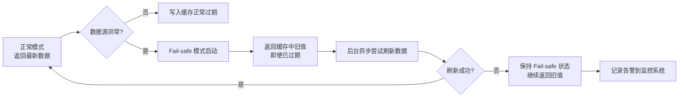

<div align="right">
  <a href="Home">← 返回首页</a>
</div>

---

# 23 FusionCache缓存

> 基于 FusionCache 的双层缓存架构：L1 内存 + L2 Redis + Pub/Sub 失效广播，雪崩防护。
>
> **适用角色**：架构师、后端开发
> **阅读时间**：约 10 分钟
> **相关文档**：[22-Elasticsearch](22-Elasticsearch) · [33-深入架构剖析](33-深入架构剖析)
> 最后更新: 2026-06-13

---

## 📋 目录

- [一、缓存架构](#一、缓存架构)
  - [分层示意](#分层示意)
  - [读写路径](#读写路径)
  - [失效广播（多节点同步](#失效广播（多节点同步)
- [二、缓存类型与 Key 规范](#二、缓存类型与-key-规范)
  - [Key 命名约定](#key-命名约定)
- [三、核心服务：CacheService](#三、核心服务：cacheservice)
  - [CacheStats 示例返回](#cachestats-示例返回)
- [四、缓存失效策略](#四、缓存失效策略)
  - [4.1 主动失效（最高优先级）](#41-主动失效（最高优先级）)
  - [4.2 TTL 自动过期（兜底）](#42-ttl-自动过期（兜底）)
  - [4.3 滑动过期](#43-滑动过期)
  - [4.4 事件广播（Pub/Sub）](#44-事件广播（pub-sub）)
- [五、缓存穿透 / 击穿 / 雪崩防护](#五、缓存穿透-击穿-雪崩防护)
  - [5.1 穿透：null 值占位](#51-穿透：null-值占位)
  - [5.2 击穿：FusionCache 的锁机制](#52-击穿：fusioncache-的锁机制)
  - [5.3 雪崩：抖动 + 预热 + 断路器](#53-雪崩：抖动-预热-断路器)
- [六、缓存预热](#六、缓存预热)
  - [启动时预加载](#启动时预加载)
  - [每日 04:00 定时刷新](#每日-0400-定时刷新)
- [七、监控与管理](#七、监控与管理)
  - [缓存管理页面](#缓存管理页面)
  - [管理接口](#管理接口)
  - [告警规则](#告警规则)
- [八、Redis 配置（appsettings.json）](#八、redis-配置（appsettingsjson）)

---


> FusionCache 采用 **双层缓存（Memory + Redis）+ 失效广播机制，提供 fail-safe、击穿防护、滑动过期等高级特性。

---

## 一、缓存架构

### 分层示意

```
┌──────────────────────────────────────────────────────┐
│ 应用服务器内存 (Memory Cache / L1)               │
│                                                      │
│  • 极快: < 1 ms                                     │
│  • 容量受限: 通常 1 ~ 2 GB                         │
│  • 单节点可见                                        │
│  • key: "auth:user:admin                         │
├──────────────────────────────────────────────────────┤
│ 分布式缓存 (Redis / L2)                              │
│                                                      │
│  • 较快: 1 ~ 5 ms                                   │
│  • 容量大: 几十 GB                                  │
│  • 多节点共享                                         │
│  • Pub/Sub 通知机制（失效广播）                   │
│  • key: "jeesite:auth:user:admin"                │
└──────────────────────────────────────────────────────┘
```

### 读写路径

```
            GET(key)
              │
       ┌──────▼──────┐
       │ 命中 L1？  │ → 直接返回（< 1ms）
       └──────┬──────┘
              否
              ▼
       ┌──────▼──────┐
       │ 命中 L2？  │ → 返回，同步回写 L1
       └──────┬──────┘
              否
              ▼
       ┌──────▼──────┐
       │ 执行 factory │ → 从数据库读取
       │  (DB Query)   │
       └──────┬──────┘
              ▼
        同时写入 L1 + L2
```

### 失效广播（多节点同步

- 任一节点执行 `Set / Remove` 操作
- 通过 Redis Pub/Sub 通道（`jeesite-fc`）广播 `Invalidate(key)`
- 其他节点收到后清除本地 L1 中对应 key
- 后续请求将从 L2 / 源头重新加载

---

## 二、缓存类型与 Key 规范

| 缓存类型 | Key 格式 | 内容示例 | 默认过期时间 |
|---------|---------|---------|-----------|
| 用户权限 | `auth:perm:{userCode}` | 用户权限标识集合（`List<string>`） | 2 小时 / 登出主动失效 |
| 用户信息 | `auth:user:{userCode}` | 用户基本信息（名称/所属机构） | 2 小时 |
| 菜单树 | `menu:tree:{userCode}:{sysCode}` | 用户可访问的菜单 JSON 树 | 2 小时 |
| 字典数据 | `dict:{dictType}` | 字典数据列表 | 1 天 |
| 配置项 | `config:{configKey}` | 配置值（string / number） | 1 小时 |
| 机构树 | `org:tree:{corpCode}` | 机构树 JSON | 4 小时 |
| 公司树 | `company:tree:{corpCode}` | 公司树 JSON | 4 小时 |
| CMS 文章详情 | `cms:article:{articleId}` | 文章详情对象 | 1 小时 |
| CMS 文章列表 | `cms:list:{category}:{page}` | 分页列表（包含摘要） | 15 分钟 |
| Token 黑名单 | `jwt:revoked:{jti}` | 被吊销的 JWT ID（string placeholder） | Token 剩余有效期 |
| 业务缓存 | `{module}:{key}:{tenant}` | 各模块自定义业务缓存 | 按需配置 |

### Key 命名约定

- 总前缀由 `DistributedCacheKeyPrefix`（默认 `jeesite:`）统一控制
- 层级使用 `:` 分隔，便于 Redis 客户端按前缀扫描与清仓
- `{tenant}` 部分在多租户场景下自动注入，默认 `default`

---

## 三、核心服务：CacheService

位置：`src/JeeSiteNET.Core/Services/CacheService.cs`

| 方法 | 签名 | 说明 |
|------|------|------|
| `GetAsync<T>` | `Task<T> GetAsync<T>(string key)` | 读取缓存（L1 → L2），不存在返回 `default` |
| `SetAsync<T>` | `Task SetAsync<T>(string key, T value, TimeSpan? duration)` | 写入缓存（同时写 L1 + L2，广播失效） |
| `RemoveAsync` | `Task RemoveAsync(string key)` | 移除 key，广播所有节点 |
| `RemoveByPrefixAsync` | `Task RemoveByPrefixAsync(string prefix)` | 按前缀批量移除（依赖 Redis SCAN） |
| `GetOrCreateAsync<T>` | `Task<T> GetOrCreateAsync<T>(string key, Func<CancellationToken, Task<T>> factory, TimeSpan? duration)` | 经典 GetOrSet，**FusionCache 提供 fail-safe 保护** |
| `RefreshAsync` | `Task RefreshAsync(string key)` | 立即刷新 key 的 TTL |
| `GetStatsAsync` | `Task<CacheStats> GetStatsAsync()` | 统计命中率 / L1 内存占用 / key 数量 |

### CacheStats 示例返回

```csharp
public class CacheStats
{
    public long TotalKeys { get; set; }      // L1 中的 key 数量
    public long L1HitCount { get; set; }
    public long L2HitCount { get; set; }
    public long MissCount { get; set; }
    public double HitRate { get; set; }     // 命中率, e.g. 0.923
    public long EstimatedMemoryBytes { get; set; }
}
```

---

## 四、缓存失效策略

### 4.1 主动失效（最高优先级）

数据变更时立即调用 `RemoveAsync(key)`。

典型场景：

| 操作 | 失效的 key 示例 |
|------|----------------|
| 用户修改权限 | `auth:perm:{userCode}`、`menu:tree:{userCode}:*` |
| 修改字典 | `dict:*` |
| 修改配置 | `config:*` |
| 文章发布 / 修改 | `cms:article:*`、`cms:list:*` |

### 4.2 TTL 自动过期（兜底）

每个缓存项都有绝对过期时间，避免"永久缓存"的脏数据。

### 4.3 滑动过期

对访问频次高的 key 自动延长 TTL。通过 FusionCache 的 `options.Duration` + `Jitter` 组合实现。

### 4.4 事件广播（Pub/Sub）

```
节点 A 修改数据 → RemoveAsync(key)
                 │
                 ├── 本地 L1 立即清除
                 │
                 └── Redis Pub/Sub 广播 Invalidate(key)
                          │
                          ▼
                    节点 B / C / D ...
                       清除本地 L1[key]
```

---

## 五、缓存穿透 / 击穿 / 雪崩防护

| 问题 | 现象 | 防护方案 |
|------|------|---------|
| **穿透** | 恶意请求一个不存在的 key，每次都打到数据库 | 对不存在的 key 写入 null 值占位，5 分钟 TTL |
| **击穿** | 热点 key 过期瞬间，大量请求同时涌入 DB | FusionCache 内置锁机制，同一 key 只有一个 factory 执行，其他请求等待结果或使用 fail-safe 值 |
| **雪崩** | 大量 key 同时过期，DB 瞬间压力暴增 | 1. 随机化过期时间（±5 分钟抖动） 2. 热点数据预加载 3. 断路器（Circuit Breaker）模式 |

### 5.1 穿透：null 值占位

```csharp
// CacheService.GetOrCreateAsync 内部伪代码
var value = await db.Query(...);
if (value == null) {
    // 写入 null 占位，5 分钟过期
    await cache.SetAsync(key, null, TimeSpan.FromMinutes(5));
}
return value;
```

### 5.2 击穿：FusionCache 的锁机制

FusionCache 对同一 key 的并发请求采用以下流程：

```
请求 1 获得锁 → 执行 factory → 写入缓存 → 释放锁 → 返回
请求 2 等待... → 从缓存取
请求 3 等待... → 从缓存取
```

### 5.3 雪崩：抖动 + 预热 + 断路器

- **抖动**：`options.JitterMaxDuration = TimeSpan.FromMinutes(5)`
- **预热**：启动时加载字典、配置、机构树（见第六节）
- **断路器**：当 DB 响应时长超过阈值（如 5s），自动降级返回 fail-safe 值

---

## 六、缓存预热

### 启动时预加载

应用启动后（`Program.cs` 的 `HostedService` 中）依次加载：

```csharp
await cacheService.GetOrCreateAsync("dict:sys_common", async () => {
    return await dbContext.DictTypes
        .Where(d => d.Status == "0")
        .ToListAsync();
}, TimeSpan.FromDays(1));

// 类似地：系统配置、机构/公司树、热门栏目文章...
```

### 每日 04:00 定时刷新

由 `Tasks` 模块的定时任务执行：

```
0 4 * * *  →  调用 CacheService.RefreshHotKeys()
                扫描热门 key 并刷新
```

---

## 七、监控与管理

### 缓存管理页面

**系统管理 → 系统监控 → 缓存管理**

```
┌──────────────────────────────────────────────────────┐
│  模块    │ 命中率 │  key 数 │ 内存 (MB) │ 操作  │
├──────────────────────────────────────────────────────┤
│  auth    │  94.2% │   2,103 │    12.3 │ [清] │
│  dict    │  99.1% │      87 │     0.8 │ [清] │
│  cms     │  88.6% │  18,292 │    85.1 │ [清] │
│  config  │  97.0% │     120 │     0.3 │ [清] │
│  全部    │  92.1% │  38,512 │   134.6 │ [清] │
└──────────────────────────────────────────────────────┘
```

### 管理接口

| HTTP | 路径 | 说明 |
|------|------|------|
| GET | `/api/v1/sys/cache/stats` | 各模块命中率统计 |
| GET | `/api/v1/sys/cache/list?prefix=auth` | 按前缀列出 key |
| POST | `/api/v1/sys/cache/remove` | 移除指定 key（body: `{ "key": "auth:user:admin" }`） |
| POST | `/api/v1/sys/cache/clear` | 清除整个缓存（⚠️ 需二次确认） |

### 告警规则

| 规则 | 触发条件 | 建议动作 |
|------|---------|---------|
| 命中率低于 70% | `HitRate < 0.7` | 检查缓存 key 设计或 TTL 配置 |
| L1 内存占用 > 1.5 GB | `EstimatedMemoryBytes > 1.5GB` | 检查 L1 size 限制，考虑增大 Redis |
| Redis 连接失败 | Redis 连接超时 | 降级到纯 L1 模式，告警 |

---

## 八、Redis 配置（appsettings.json）

```json
{
  "FusionCache": {
    "RedisConnectionString": "localhost:6379,allowAdmin=true,password=your-redis-password,connectTimeout=5000,syncTimeout=1000",
    "DistributedCacheKeyPrefix": "jeesite:",
    "BackplaneChannelName": "jeesite-fc",
    "DefaultEntryDurationMinutes": 60,
    "EnableFailSafe": true,
    "EnableOptimisticConcurrency": true,
    "JitterMaxDurationMinutes": 5,
    "MemoryCacheSizeLimitMb": 2048,
    "DistributedCacheHardTimeoutMs": 5000,
    "FactorySoftTimeoutMs": 100,
    "FactoryHardTimeoutMs": 3000
  }
}
```

| 配置项 | 说明 |
|--------|------|
| `RedisConnectionString` | Redis 连接字符串（支持 password/timeout） |
| `DistributedCacheKeyPrefix` | L2 key 前缀，避免与其他应用冲突 |
| `BackplaneChannelName` | Pub/Sub 通道名 |
| `DefaultEntryDurationMinutes` | 默认缓存有效期（分钟） |
| `EnableFailSafe` | 启用 fail-safe（DB 不可用时返回旧值） |
| `EnableOptimisticConcurrency` | 启用乐观并发控制 |
| `JitterMaxDurationMinutes` | 过期时间抖动（±此值内随机，避免雪崩） |
| `MemoryCacheSizeLimitMb` | L1 内存容量上限 |
| `FactorySoftTimeoutMs` | factory 软超时（超过后开始并行执行但继续等待） |
| `FactoryHardTimeoutMs` | factory 硬超时（超过后强制使用 fail-safe 值） |

---

*文档最后更新：2026-06-12*
---

<div align="center">
  <small>本文档最后更新: 2026-06-12 · JeeSite.NET Wiki</small>
</div>

---

## 🏗️ 架构与数据流

### 双层缓存读取流程图

```mermaid
flowchart TD
    A[请求数据 cache.GetOrSetAsync(key)] --> B{L1 内存缓存<br/>命中?}
    B -->|是| C[直接返回内存中的值<br/>(~0.1ms)]
    B -->|否| D{L2 Redis 缓存<br/>命中?}
    D -->|是| E[从 Redis 获取<br/>写入 L1 内存缓存]
    E --> C
    D -->|否| F[执行工厂方法<br/>(实际查询数据库)]
    F --> G[DB 查询并获取结果]
    G --> H[写入 L2 Redis 缓存]
    H --> I[写入 L1 内存缓存]
    I --> C

    J[其他实例发布失效通知<br/>Redis Pub/Sub] --> K[本实例订阅失效消息]
    K --> L[清除 L1 内存缓存]
    L --> B

    style B fill:#9f9,stroke:#333
    style D fill:#ff9,stroke:#333
    style F fill:#f99,stroke:#333
```

### Fail-safe 降级机制图



---

## 💡 快速参考

### 核心类与接口

| 类型 | 名称 | 命名空间 | 说明 |
|------|------|---------|------|
| Service | `FusionCache` (IFusionCache) | ZiggyCreatures.FusionCache | 双层缓存（内存 + Redis + Pub/Sub 失效广播 |
| Service | `CacheService` | `JeeSiteNET.Core.Services` | 业务统一缓存封装（Get/Set/RemoveByPrefix/GetOrCreate/Stats） |
| Options | `FusionCacheOptions` | ZiggyCreatures.FusionCache | 全局缓存配置 |

### 常用 API 速查

| API | 说明 |
|-----|------|
| `cache.GetOrSetAsync<T>(key, factory, options)` | 获取或设置缓存，自动防穿透、击穿 |
| `cache.GetAsync<T>(key)` | 读取缓存值（L1 → L2） |
| `cache.SetAsync<T>(key, value, options)` | 写入缓存（同时写 L1 + L2） |
| `cache.RemoveAsync(key)` | 移除缓存，并广播失效 |
| `cache.RemoveByPrefixAsync(prefix)` | 按前缀批量移除（依赖 Redis SCAN） |
| `cache.ExpireAsync(key, duration)` | 设置过期时间 |
| `cache.GetStatsAsync()` | 统计命中率 / L1 内存 / key 数量 |

### 最小工作示例

```csharp
// ===== Program.cs：注册 FusionCache =====
builder.Services.AddFusionCache()
    .WithSerializer(new FusionCacheSystemTextJsonSerializer())
    .WithDistributedCache(new RedisCache(new RedisCacheOptions
    {
        Configuration = builder.Configuration.GetConnectionString("Redis")
    }))
    .WithBackplane(new RedisBackplane(new RedisBackplaneOptions
    {
        Configuration = builder.Configuration.GetConnectionString("Redis")
    }));

// 同时注册业务封装
builder.Services.AddScoped<CacheService>();

// ===== 业务服务中使用（推荐方式）=====
private readonly CacheService _cache;

public async Task<User?> GetUserAsync(string userId, CancellationToken ct)
{
    return await _cache.GetOrCreateAsync(
        key: $"auth:user:{userId}",
        factory: async (token) => await _userRepository.GetByIdAsync(userId, token),
        duration: TimeSpan.FromMinutes(30)  // TTL
    );
}

// ===== 主动失效（数据变更时）=====
public async Task UpdateUserAsync(User user, CancellationToken ct)
{
    await _userRepository.UpdateAsync(user, ct);
    await _cache.RemoveAsync($"auth:user:{user.UserCode}", ct);  // L1/L2 同时失效，广播到所有节点
}

// ===== 批量失效（栏目下所有文章）=====
await _cache.RemoveByPrefixAsync("cms:article:");
// 底层：Redis SCAN 遍历匹配 key 后批量 DEL

// ===== Fail-safe 兜底（Redis 挂了？自动降级纯内存）=====
// 当 L2 Redis 不可用时，FusionCache 自动降级到 L1 纯内存模式，
// 同时 fail-safe 模式下即使 factory 失败也返回最近一次成功值。
// 这是与传统 IDistributedCache 最大的区别。
```

### Key 命名规范

| 业务场景 | Key 格式 | 建议 TTL |
|----------|---------|---------|
| 用户权限 | `auth:perm:{userCode}` | 2 小时 / 登出主动失效 |
| 用户信息 | `auth:user:{userCode}` | 2 小时 |
| 菜单树 | `menu:tree:{userCode}:{sysCode}` | 2 小时 |
| 字典数据 | `dict:{dictType}` | 1 天 |
| 配置项 | `config:{configKey}` | 1 小时 |
| CMS 文章详情 | `cms:article:{articleId}` | 1 小时 |
| CMS 文章列表 | `cms:list:{category}:{page}` | 15 分钟 |
| Token 黑名单 | `jwt:revoked:{jti}` | Token 剩余有效期 |

### 配置项清单

| 配置键 | 默认值 | 数据类型 | 说明 | 必填 |
|--------|--------|---------|------|------|
| `ConnectionStrings:Redis` | (空) | string | Redis 连接字符串（L2 + Backplane 共用） | ✅ |
| `FusionCache:DistributedCacheKeyPrefix` | `jeesite:` | string | L2 key 前缀，避免与其他项目冲突 | ⬜ |
| `FusionCache:BackplaneChannelName` | `jeesite-fc` | string | Pub/Sub 通道名 | ⬜ |
| `FusionCache:DefaultEntryDurationMinutes` | `60` | int | 默认缓存有效期（分钟） | ⬜ |
| `FusionCache:EnableFailSafe` | `true` | bool | 启用故障安全（不可用时返回旧值） | ⬜ |
| `FusionCache:JitterMaxDurationMinutes` | `5` | int | 过期时间抖动范围（±此值随机，防雪崩） | ⬜ |
| `FusionCache:MemoryCacheSizeLimitMb` | `2048` | int | L1 内存容量上限（MB） | ⬜ |
| `FusionCache:FactorySoftTimeoutMs` | `100` | int | factory 软超时（超过后并行执行但继续等待） | ⬜ |
| `FusionCache:FactoryHardTimeoutMs` | `3000` | int | factory 硬超时（超过后强制 fail-safe） | ⬜ |
| `Cache:FailSafeMaxDurationHours` | `24` | int | 故障安全最大保留时长（超出不再使用） | ⬜ |

---

## ❓ 常见问题

**Q1：Redis 挂了服务会不会崩？**
- 不会。FusionCache 自动降级到纯内存模式：已有 L1 缓存继续服务，新请求走数据库。
- `EnableFailSafe=true` 时，即使数据库也不可用，仍会返回最近一次成功值（如字典数据、用户菜单树）。

**Q2：缓存穿透（恶意请求不存在的 key）如何处理？**
- 使用 `GetOrCreateAsync` 自动处理：空值（null / default）也会被短暂缓存（默认 5 分钟）。
- 布隆过滤器可作为补充层。

**Q3：分布式多节点部署如何保持一致性？**
- 通过 Redis Backplane（`jeesite-fc` 通道）广播 `Invalidate(key)`，各节点自动同步清除本地 L1。
- 任一节点执行 `RemoveAsync` 时，所有节点的 L1 都会同步失效。

**Q4：缓存击穿（热点 key 过期瞬间大流量涌入数据库）？**
- FusionCache 内置锁机制：同一 key 并发请求时，仅一个线程执行 factory，其余等待结果或使用 fail-safe 值。
- 可通过 `JitterMaxDurationMinutes` 加随机抖动避免批量过期。

**Q5：如何监控缓存命中率？**
- 调用 `_cache.GetStatsAsync()` 获取 `TotalKeys` / `HitRate` / `L1HitCount` / `L2HitCount`。
- 建议在管理后台「缓存管理页面实时查看。
- 命中率低于 70% 时告警，检查 key 设计或 TTL 配置。

**Q6：更新数据后如何确保缓存失效？**
- **主动失效：`RemoveAsync(key)` 或 `RemoveByPrefixAsync(prefix)`。
- **事件驱动**：领域事件（如 `UserUpdatedEvent`）触发失效（推荐，可跨模块解耦）。
- **TTL兜底**：即使忘记主动失效，TTL 也会在指定时间内自然过期。

---

## 📚 相关文档

- [22-Elasticsearch](22-Elasticsearch) — 搜索结果高频缓存
- [15-JWT认证](15-JWT认证) — Token 黑名单缓存
- [19-数据与字段权限](19-数据与字段权限) — 用户权限缓存
- [20-AI智能问答](20-AI智能问答) — 会话历史与消息缓存
- Home: [Wiki 首页](Home)

---

## 🚀 下一步

1. **预热关键数据**：在 `Program.cs` 中 `HostedService` 启动时预加载字典、配置、机构树，避免首次请求直接查询延迟。
2. **配置告警规则**：命中率 < 70%、L1 占用 > 1.5GB、Redis 连接失败配置告警通知。
3. **优化热点 key 抖动**：对热点数据设置 `JitterMaxDurationMinutes`，避免批量同时过期导致的缓存雪崩。
4. **业务层统一使用 `CacheService`**：新业务请使用 `GetOrCreateAsync`，避免手写 `if/else` 缓存逻辑。
5. **Review 所有数据变更场景**：确保每个写操作都对应正确的缓存失效 key（可通过单元测试覆盖）。

<div align="center">
  <small>本文档最后更新: 2026-06-13 · JeeSite.NET Wiki</small>
</div>